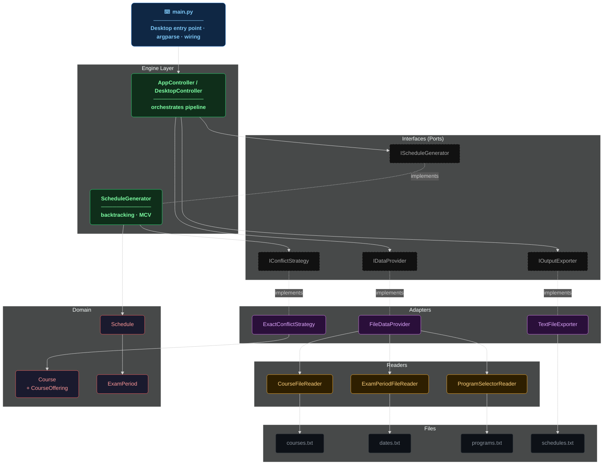
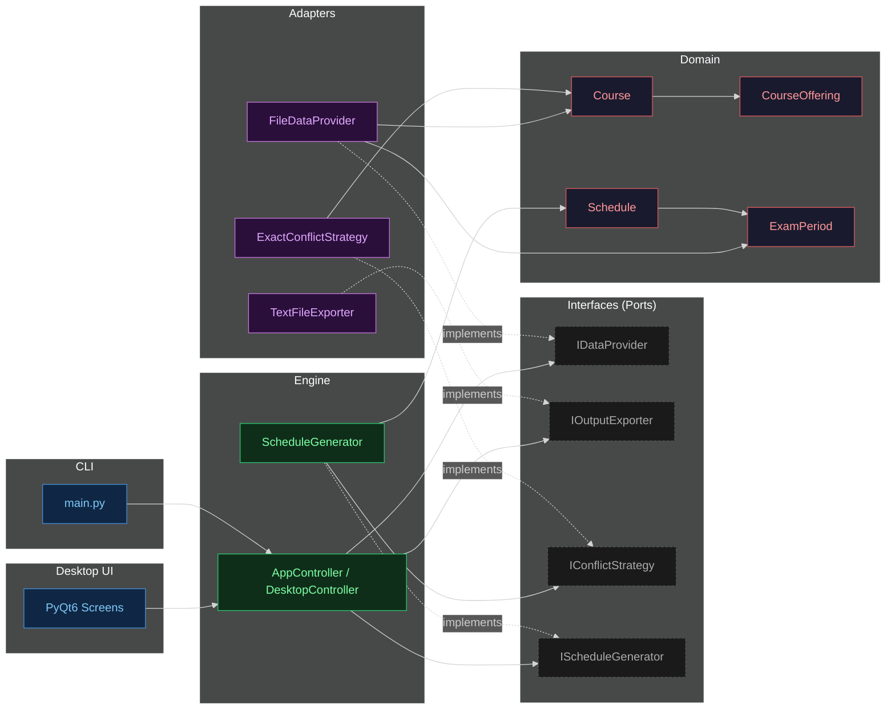
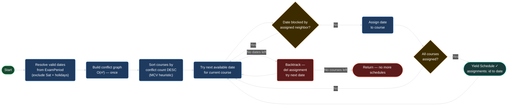

# examSchedule



> **University exam scheduler** — given a course catalog, exam windows, and a set of study programs, generates every valid conflict-free timetable using a backtracking CSP solver with an MCV heuristic.


---

## Table of Contents

- [Overview](#overview)
- [Architecture](#architecture)
- [Domain Model](#domain-model)
- [Scheduling Algorithm](#scheduling-algorithm)
- [Project Structure](#project-structure)
- [Setup](#setup)
- [Usage](#usage)
- [Input File Formats](#input-file-formats)
- [Output Format](#output-format)
- [Testing](#testing)
- [All Diagrams](#all-diagrams)

---

## Overview

`examSchedule` solves the exam timetabling problem as a **Constraint Satisfaction Problem (CSP)**.

The current project scope is a **PyQt6 desktop application** with a file-based data model and optional headless CLI mode.

Main capabilities:

- Loads courses, exam periods, and selected programs from plain-text files
- Allows the user to work through a desktop UI
- Determines which courses conflict — two courses conflict when students in the same program, year, and semester are enrolled in both, unless both are elective
- Runs a backtracking search over valid exam dates, using the **Most-Constrained-Variable (MCV)** heuristic to assign the hardest-to-place courses first
- Yields every valid complete schedule **lazily** — no list of all schedules is ever held in memory by the core generator
- Displays generated schedules in the desktop results screen
- Allows exporting schedules to a structured text file, grouped by semester and moed
- Imports previously generated schedule files back into the Results panel for review

### Phase 3 Capabilities — Optimal Scheduling

Phase 3 turns the raw set of valid schedules into a *ranked, filtered* result set:

- **Threshold filtering** — discard schedules that violate configurable limits, such as a minimum number of days between mandatory exams or a maximum number of exams per day.
- **Advanced sorting** — rank the surviving schedules by quality metrics: minimum days between exams, average days between exams, number of elective collisions, and more.
- **Real-time control** — thresholds and sort criteria can be toggled on/off and re-ordered on the fly, so the user can re-rank results without regenerating them.

### Feature 4 Capabilities — Classroom & Time Slot Assignment

Feature 4 extends a finished schedule with physical room and staffing logistics:

- **Automatic classroom assignment** — rooms are allocated by matching exact per-course student counts against room capacities.
- **Time slot distribution** — exams are spread chronologically into configurable daily time slots, honoring the mandatory gap between slots.
- **Proctor recommendation report** — the number of proctors per room is computed automatically as `ceil(students_in_room / X)` and emitted as a recommendation report.
- **Optional & graceful** — the whole feature is optional; if classroom, slot, or proctor data is missing, the system gracefully degrades to standard scheduling instead of failing.

**Key design properties:**

| Property | Implementation |
|---|---|
| Architecture | Clean Architecture — Ports & Adapters |
| UI | PyQt6 desktop application |
| Algorithm | Backtracking CSP + MCV heuristic |
| Memory model | Lazy `Iterator[Schedule]` — O(n) stack depth |
| Conflict graph | Built once O(n²), reused across all backtrack steps |
| Extensibility | Swap any adapter without touching the engine |

---

## Architecture

The system is divided into five strict layers. **Inner layers never import outer layers.**



| Layer | Responsibility |
|---|---|
| **Desktop UI** | PyQt6 screens for loading data, selecting programs, editing exam dates, generating schedules, and exporting |
| **CLI** | Optional headless entry point: parse arguments, wire dependencies, run the controller |
| **Engine** | Controller orchestration and scheduling algorithm |
| **Interfaces** | Abstract ports (ABCs) — the engine only ever imports these |
| **Adapters** | Concrete implementations: file I/O, conflict detection, schedule export |
| **Domain** | Pure data containers + domain rules — zero I/O |

---

## Domain Model

```mermaid
classDiagram
    direction TB

    namespace Domain {
        class Course {
            +id : str
            +name : str
            +instructor : str
            +evaluation_type : str
            +offerings : List~CourseOffering~
            +add_offering(offering: CourseOffering) None
            +has_exam() bool
            +get_relevant_offerings(programs: List, semester: str) List~CourseOffering~
            +is_relevant_for_period(programs: List, semester: str) bool
        }
        class CourseOffering {
            +program_id : str
            +year : int
            +semester : str
            +requirement : str
            +is_relevant(programs: List, semester: str) bool
            +is_elective() bool
            +same_program_year_semester(other: CourseOffering) bool
        }
        class ExamPeriod {
            +semester : str
            +moed : str
            +date_ranges : List~Tuple~date_date~~
            +excluded_dates : Set~date~
            +get_valid_dates() List~date~
            +get_key() str
        }
        class Schedule {
            +period : ExamPeriod
            +assignments : Dict~str_date~
        }
    }

    namespace Interfaces {
        class IDataProvider {
            <<interface>>
            +get_courses() List~Course~
            +get_exam_periods() List~ExamPeriod~
            +get_selected_programs() List~str~
        }
        class IOutputExporter {
            <<interface>>
            +export_schedules(schedules_by_period: Dict, courses_by_id: Dict) None
        }
        class IConflictStrategy {
            <<interface>>
            +is_conflict(course1: Course, course2: Course) bool
        }
        class IScheduleGenerator {
            <<interface>>
            +generate_schedules(courses: List, period: ExamPeriod) Iterator~Schedule~
        }
    }

    namespace Engine {
        class AppController {
            <<controller>>
            -_data_provider : IDataProvider
            -_exporter : IOutputExporter
            -_generator : IScheduleGenerator
            -_selected_programs : List~str~
            +run() None
            -_sort_exam_periods(periods) List~ExamPeriod~
            -_validate_selected_programs_exist(courses) None
        }
        class ScheduleGenerator {
            <<engine>>
            -_strategy : IConflictStrategy
            +generate_schedules(courses: List, period: ExamPeriod) Iterator~Schedule~
            -_build_conflict_graph(courses: List) Dict~Course_Set~Course~~
            -_backtrack(assignment remaining valid_dates conflict_graph period) Iterator~Schedule~
        }
    }

    namespace Adapters {
        class FileDataProvider {
            <<adapter>>
            +course_reader : CourseFileReader
            +exam_period_reader : ExamPeriodFileReader
            +program_reader : ProgramSelectorReader
            +get_courses() List~Course~
            +get_exam_periods() List~ExamPeriod~
            +get_selected_programs() List~str~
        }
        class TextFileExporter {
            <<adapter>>
            +output_path : Path
            +export_schedules(schedules_by_period: Dict, courses_by_id: Dict) None
            -_write_period_header(file semester: str, moed: str) None
            -_write_schedule(file n: int, schedule: Schedule, courses_by_id: Dict) None
            -_split_period_key(period_key: str) Tuple~str_str~
        }
        class ExactConflictStrategy {
            <<adapter>>
            -_selected_programs : Set~str~
            +is_conflict(course1: Course, course2: Course) bool
        }
    }

    namespace Readers {
        class CourseFileReader {
            +courses_path : Path
            +read() List~Course~
        }
        class ExamPeriodFileReader {
            +periods_path : Path
            +read() List~ExamPeriod~
        }
        class ProgramSelectorReader {
            +programs_path : Path
            +read() List~str~
        }
    }

    Course "1" *-- "0..*" CourseOffering : contains
    Schedule --> ExamPeriod : period

    FileDataProvider ..|> IDataProvider
    TextFileExporter ..|> IOutputExporter
    ExactConflictStrategy ..|> IConflictStrategy
    ScheduleGenerator ..|> IScheduleGenerator

    AppController --> IDataProvider : uses
    AppController --> IScheduleGenerator : uses
    AppController --> IOutputExporter : uses
    ScheduleGenerator --> IConflictStrategy : consults
    ScheduleGenerator ..> Schedule : yields

    FileDataProvider --> CourseFileReader : delegates
    FileDataProvider --> ExamPeriodFileReader : delegates
    FileDataProvider --> ProgramSelectorReader : delegates
```



---

## Scheduling Algorithm



**Conflict rule** — two courses conflict when there exists a shared offering where:

- Same `program_id`
- Same `year`
- Same `semester`
- Not both elective

Only offerings from **selected programs** are evaluated. Courses that belong only to unselected programs are ignored by the conflict strategy.

---

## Project Structure

```text
examSchedule/
├── main.py                          # Entry point — desktop app by default, or --cli for headless
├── data/
│   ├── courses.txt                  # Course catalog with per-program offerings
│   ├── dates.txt                    # Exam periods, date ranges, and exclusions
│   └── programs.txt                 # Selected program IDs for CLI runs
├── src/
│   ├── controller.py                # DesktopController — bridge between UI and engine
│   ├── ui/                          # PyQt6 desktop application
│   │   ├── app.py                   # QMainWindow entry point
│   │   ├── input_screen.py          # Main widget: file loading, generation, results tabs
│   │   ├── date_editor.py           # Inline date-range editor widget
│   │   ├── style.py                 # QSS stylesheet loader
│   │   ├── stylesheet.qss           # Design tokens and component styling
│   │   └── tokens.py                # Colour and spacing constants
│   ├── domain/                      # Pure data containers — zero I/O
│   │   ├── course.py
│   │   ├── course_offering.py
│   │   ├── exam_period.py
│   │   ├── schedule.py
│   │   └── semester.py
│   ├── interfaces/                  # Abstract ports
│   │   ├── i_data_provider.py
│   │   ├── i_conflict_strategy.py
│   │   ├── i_schedule_generator.py
│   │   └── i_output_exporter.py
│   ├── engine/                      # Core logic — depends only on interfaces
│   │   ├── app_controller.py
│   │   └── schedule_generator.py
│   └── adapters/                    # Concrete implementations
│       ├── exact_conflict_strategy.py
│       ├── file_data_provider.py
│       ├── text_file_exporter.py
│       └── readers/
│           ├── course_file_reader.py
│           ├── exam_period_file_reader.py
│           └── program_selector_reader.py
├── tests/
│   ├── unit/                        # Unit tests for domain, engine, adapters, readers, controller logic
│   ├── e2e/                         # End-to-end desktop and pipeline flows
│   └── ui/                          # PyQt6 smoke and UI-controller tests
└── diagrams.md                      # Full Mermaid diagram set
```

---

## Setup

### 1. System libraries (Linux only)

PyQt6 requires several native graphics and display libraries. Install them before running `pip install`:

```bash
sudo apt-get update
sudo apt-get install -y \
  libegl1 libgl1 libgl1-mesa-glx \
  libxkbcommon0 libxkbcommon-x11-0 \
  libfontconfig1 libfreetype6 \
  libdbus-1-3 libglib2.0-0 \
  libx11-6 libx11-xcb1 \
  libxcb1 libxcb-cursor0 libxcb-icccm4 libxcb-image0 \
  libxcb-keysyms1 libxcb-randr0 libxcb-render-util0 \
  libxcb-shape0 libxcb-xfixes0 libxcb-xinerama0 libxcb-xkb1
```

> **macOS / Windows:** these libraries are bundled with the PyQt6 wheel — no extra step needed.

### 2. Python environment

```bash
cd examSchedule
python -m venv venv
```

macOS/Linux:

```bash
source venv/bin/activate
```

Windows:

```bash
.\venv\Scripts\activate
```

### 3. Python dependencies

```bash
pip install -r requirements.txt
```

For development and tests:

```bash
pip install -r requirements-dev.txt
```

### 4. Run the desktop app

```bash
python main.py
```

---

## Usage

### Desktop app

The default mode launches the PyQt6 desktop application:

```bash
python main.py
```

The desktop app supports:

- Loading course and date files
- Selecting up to five study programs
- Viewing selected program information
- Editing exam-period date exclusions
- Generating schedules
- Browsing generated schedules
- Exporting a selected schedule or result set to a readable text file
- **Importing a previously generated schedule** — use the "Load Schedule" button on the Config Screen to load an existing `schedules.txt` file and view it directly in the Results panel

### CLI Usage

The CLI supports three operating modes. All modes share the same four base arguments.

#### Base Mode — Standard Scheduling (Feature 4 OFF)

Generates conflict-free exam schedules without classroom assignment:

```bash
python main.py --cli \
  --programs selected_programs.txt \
  --courses  courses.txt \
  --periods  exam_periods.txt \
  --output   schedules.txt
```

#### Phase 3 Mode — Thresholds & Sorting

Activates Phase 3 sorting, filtering, and threshold rules defined in a settings file:

```bash
python main.py --cli \
  --programs selected_programs.txt \
  --courses  courses.txt \
  --periods  exam_periods.txt \
  --output   schedules.txt \
  --settings data/settings.txt
```

`data/settings.txt` controls sort order and result-count thresholds as specified in the SRS Phase 3 requirements.

#### Feature 4 Mode — Classroom Assignment (Feature 4 ON)

Assigns physical classrooms, time slots, and proctors to every scheduled exam.

> **Note:** `courses.txt` must include the **5th column (`StudentCount`)** for capacity matching to work.

```bash
python main.py --cli \
  --programs    selected_programs.txt \
  --courses     courses.txt \
  --periods     exam_periods.txt \
  --output      schedules.txt \
  --classrooms  classrooms.txt \
  --slots       slots.txt \
  --proctor     proctors.txt
```

`--classrooms`, `--slots`, and `--proctor` are all optional; omitting them disables Feature 4 and falls back to Base Mode. Existing scripts that do not pass these flags are 100% backward-compatible.

---

## Input File Formats

### `programs.txt`

Comma-separated 5-digit program IDs:

```text
83101, 83102, 83108
```

### `courses.txt`

Records are delimited by `$$$$`.

Each record contains:

1. Course name
2. Course ID
3. Instructor
4. One or more offering lines
5. Evaluation type

Example:

```text
$$$$
Calculus 1
83112
Dr. Erez Scheiner
83101, 1, FALL, Obligatory
83102, 1, FALL, Obligatory
Exam
$$$$
```

Evaluation types:

```text
Exam
Project
Attendance
```

Only `Exam` courses are scheduled.

### `dates.txt`

Exam-period records are delimited by `$$$$`.

Example:

```text
$$$$
FALL, Aleph
29-01-2026, 11-03-2026
- 14-02-2026
- 02-03-2026, 04-03-2026  Purim
$$$$
```

Semesters:

```text
FALL
SPRI
SUMM
```

Moeds:

```text
Aleph
Bet
Gimel
```

Saturdays are excluded automatically.

---

## Output Format

### Where files are written

`--output` is honored **exactly** — the schedule file is written to the path you
provide, verbatim:

- `--output schedules.txt` → writes `schedules.txt` in the current directory.
- `--output output/schedules.txt` → writes `output/schedules.txt` (it is **not**
  rewritten to `output/output/schedules.txt`).

Any missing parent directory is created automatically so the write succeeds. In
Feature 4 mode the proctor report is written next to the schedule file, reusing
its name with a `_proctor` suffix — e.g. `--output path/to/schedules.txt`
produces the report at `path/to/schedules_proctor.txt`.

Results are written to the specified output file, grouped by semester then moed. Courses within each schedule are sorted chronologically.

```text
=== SEMESTER: FALL ===
--- Moed: Aleph ---

Schedule #1:
  - Physics 1 | Course ID: 83102 | Date: 29-01-2026 | Instructor: Prof. O. Some
  - Calculus 1 | Course ID: 83112 | Date: 30-01-2026 | Instructor: Dr. Erez Scheiner

Schedule #2:
  - Physics 1 | Course ID: 83102 | Date: 29-01-2026 | Instructor: Prof. O. Some
  - Calculus 1 | Course ID: 83112 | Date: 01-02-2026 | Instructor: Dr. Erez Scheiner
```

If a period produces no valid schedules, the block reads:

```text
No valid schedules found.
```

---

## Testing

The test scope matches the current **PyQt6 desktop application** architecture.

HTTP/API testing is not part of the current project scope.
There are no FastAPI endpoint tests, no HTTP integration tests, and no `pytest-asyncio` API tests.

```bash
# Full suite (requires PyQt6 + system libs above)
QT_QPA_PLATFORM=offscreen python -m pytest tests/ -v

# Unit tests only
python -m pytest tests/unit/ -v

# E2E tests only
python -m pytest tests/e2e/ -v

# UI tests only (requires PyQt6)
QT_QPA_PLATFORM=offscreen python -m pytest tests/unit/test_ui_smoke.py tests/unit/test_ui_controller_integration.py -v
```

**511 tests · all passing**

| Suite | Scope |
|---|---|
| Unit tests | Domain objects, readers, adapters, scheduling logic, conflict strategy, and controller-level behavior |
| UI smoke tests | Verify the PyQt6 app launches, the configuration screen is shown, and the main controls are rendered |
| UI-controller integration tests | Verify UI actions update controller state and trigger generation/export behavior |
| E2E desktop flow tests | Full user flows such as loading files, selecting programs, generating schedules, browsing results, and exporting |
| Edge-case tests | Empty files, invalid data, more than five selected programs, repeated navigation, stale state prevention |

### Unit Test Coverage

| Module | What it covers |
|---|---|
| `test_course.py` | Course lifecycle, evaluation type, semester filtering |
| `test_course_offering.py` | Relevance, elective flag, same program-year-semester match |
| `test_exam_period.py` | Valid dates, Saturday exclusion, holiday ranges, multi-range periods |
| `test_conflict_strategy.py` | Conflict matrix, selected-program filtering, elective behavior |
| `test_schedule_generator.py` | MCV ordering, backtracking, lazy iterator, impossible cases |
| `test_file_data_provider.py` | Parsing, validation, duplicate IDs, malformed input |
| `test_text_file_exporter.py` | Output format, overwrite behavior, semester display |
| `test_schedule.py` | Schedule construction and assignment storage |
| `test_controller.py` | Desktop controller state, generation flow, export protection |

### Desktop UI Test Coverage

| Area | What it verifies |
|---|---|
| App launch | The PyQt6 application starts without crashing |
| Config screen | File inputs, program selection controls, and generate button are visible |
| File loading | Replace/update flows load data into controller state correctly |
| Program selection | Selected programs filter courses and schedules correctly |
| Date editing | Excluded dates are respected by generated schedules |
| Generation flow | Spinner/progress state appears during generation and results appear after success |
| Results screen | Generated schedules are displayed and can be browsed |
| Export flow | Export creates a readable output file and blocks invalid or stale state |

### Out of Scope

The following test types are intentionally excluded from the current scope:

- HTTP endpoint tests
- FastAPI tests
- API integration tests
- `pytest-asyncio` based API tests
- Backend service tests that do not apply to the desktop app

---

## All Diagrams

Full diagram set — architecture layers, sequence diagrams, conflict logic, data flow, test architecture:

[diagrams.md](./diagrams.md)
