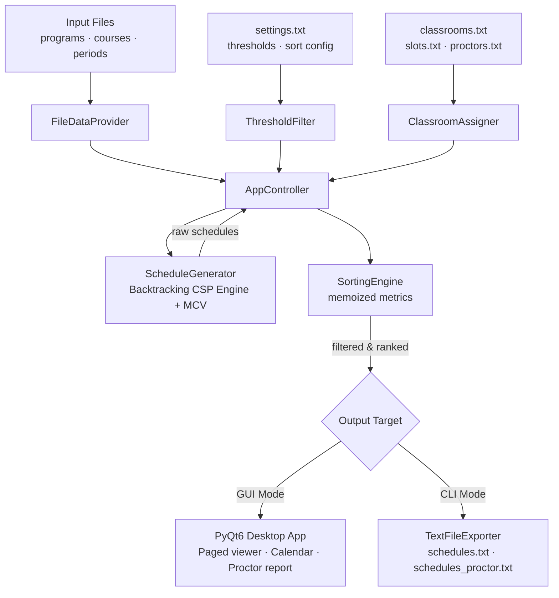

<div align="center">

# Syncademic — Exam Scheduling System

### *Turning an NP-Hard scheduling nightmare into ranked, conflict-free timetables.*

[](https://python.org)
[](#-testing)
[](https://pypi.org/project/PyQt6/)
[](#-license)

**A constraint-driven exam scheduler built around an intelligent backtracking engine —**
**with a polished PyQt6 desktop GUI and a fully feature-equivalent headless CLI.**

</div>

---

## Overview

University exam scheduling is a textbook **NP-Hard Constraint Satisfaction Problem (CSP)**. Hundreds of courses, dozens of degree programs with overlapping enrollments, fixed exam windows, holidays, room capacities, and proctor budgets all collide at once. Solving it by hand is slow and error-prone; solving it naïvely by brute force is computationally hopeless.

**Syncademic** automates the whole pipeline. It ingests your program, course, and period data, runs a lazy backtracking engine with conflict-graph pruning, then **filters, ranks, and (optionally) assigns rooms and proctors** — surfacing the best valid timetables instead of dumping every raw permutation on you.

### Core Capabilities

| Capability | Description |
|---|---|
| **Conflict-Free Scheduling** | No student in a selected program/year sits two exams in conflict |
| **Phase 3 — Multi-Level Sorting** | Reorderable, multi-criteria ranking (min gap, average gap, spread, daily load, elective collisions) |
| **Feature 4 — Strict Classroom Assignment** | Capacity-aware room splitting + proctor math `⌈students / X⌉` |
| **GUI & CLI Parity** | Every feature reachable from the desktop app *or* the headless batch CLI |
| **True Lazy Evaluation** | Generators stream schedules and room variants — the full solution space is never materialised |
| **Aggressive Memoization** | Hot sorting metrics are cached, keeping ranking fast even with all 5 criteria enabled |

---

## ✨ Features

### Phase 3 — Multi-Level Sorting

Once raw schedules are generated, Phase 3 applies threshold filtering and **multi-criteria sorting** without regenerating anything. The five criteria (spec §3.1–3.5) are all ranked **descending** (higher score ranks first):

| Criterion | Meaning |
|---|---|
| `SORT_MIN_DAYS_MANDATORY` | Minimum days between mandatory exams (same program/year) |
| `SORT_AVG_DAYS_ANY` | Average gap between any two exams (same program/year) |
| `SORT_ELECTIVE_COLLISIONS` | Elective-vs-elective same-day collisions (same program) |
| `SORT_EXAM_PERIOD_SPREAD` | Spread between first and last mandatory exam |
| `SORT_MAX_EXAMS_PER_DAY` | Densest single day, globally |

Criteria are **prioritised and reordered in real time** from the GUI (priority 1 = primary key, the rest are tie-breakers) — no regeneration pass required.

> **Sorting and the output cap.** To keep generation lazy, sorting is applied *after* a capped page of schedules is collected — never across the entire (potentially unbounded) solution space. With no cap (GUI full load) the complete collected list is sorted, so ranking is global; under the CLI's 10,000-combination cap, only the collected page is sorted. The generator is never fully materialised just to rank it.

### Feature 4 — Strict Classroom Assignment

When room data is supplied, every exam is assigned concrete rooms, time slots, and proctors:

- **Capacity splitting** — a single exam's students are split across multiple rooms with a balanced, capacity-respecting distribution; rooms that would receive zero students are dropped.
- **Proctor math** — proctors per room = `⌈students_in_room / X⌉`, where `X` is the denominator of the `1:X` ratio from `proctors.txt` (spec §4.6).
- **Graceful degradation** — if `StudentCount` is missing while Feature 4 is *off*, date-only scheduling still runs. With Feature 4 *on*, a missing count aborts the load with an explicit error.

---

## 🏗️ Under the Hood: Architecture & Algorithms

### Data Flow



### CSP Engine — Backtracking with MCV + Lazy Evaluation

The date-assignment core (`ScheduleGenerator`) is a **recursive DFS backtracker** with aggressive pruning:

1. **Conflict graph** — built once (`O(n²)`), mapping each course to the set it conflicts with, so the backtracker does `O(1)` neighbor lookups instead of re-running the conflict rule at every step.
2. **Most-Constrained-Variable (MCV) heuristic** — courses with the most conflicts are scheduled first. Failures surface early, pruning large branches of the search tree before they're explored.
3. **True lazy evaluation** — complete schedules are `yield`-ed one at a time; the partial assignment is mutated in place and restored on backtrack, so memory stays `O(n)` regardless of how many solutions exist.

### Feature 4 — Capacity Pruning to Beat $O(2^R)$

With *R* rooms, naïvely enumerating room combinations is $O(2^R)$ — intractable. `ClassroomAssigner` sidesteps the explosion:

- **Capacity-based pruning** — before recursing, it checks whether the best remaining rooms can *possibly* cover an exam's students; impossible branches are cut immediately.
- **Generator-based DFS** — room variants stream one at a time, so the UI/CLI consume only what they page through; iterators stay alive between page requests.
- **Largest-exam-first ordering** — bigger exams claim rooms first, maximising feasibility for the rest.
- **Deduplication** — a `seen` set suppresses identical distributions produced by different room combinations.

### ⚡ Aggressive Memoization Layer (new)

With all five sort criteria enabled across tens of thousands of candidate schedules, the metric helpers in `sorting_engine.py` (`_min_gap`, `_avg_gap`, `_count_same_day_pairs`) would otherwise re-reduce the *same* lists of exam dates to the *same* numbers millions of times — the root cause of UI freezes under extreme load.

These hot helpers are now backed by an **`@lru_cache` memoization layer**. Because lists are unhashable, each public wrapper normalises its input to a **sorted tuple** before delegating to the cached core — sorting is safe (all three metrics range over unordered pairs) and it collapses differently-ordered date lists onto the same cache entry, maximising the hit rate across permutations. A combinatorial stress test ranks **10,000 schedules across all 120 priority permutations**, asserting each completes in **under 1 second**.

### 🛡️ Handling Extreme Scale: Why We Don't Sort Billions

A natural question for a long-running desktop app: what stops a user who hammers **Auto Load** hundreds of times — pulling an ever-growing pile of generated schedules into the viewer — and then clicks **Result Ranking** to re-sort them? Does the app try to sort billions of options and get OOM-killed by the operating system?

It does not, by design. The reasoning is a deliberate engineering trade-off.

**1. Sorting billions requires materialising billions — and that is what causes OOM.**
Any comparison sort (`list.sort`, Timsort, quicksort) needs *random access* to the full collection: every element must be resident in RAM simultaneously so the algorithm can compare and reorder it. A schedule is a non-trivial Python object (exam dates, room assignments, proctor data). The space of solutions is a Cartesian product — *date options × classroom variants* — which is effectively **unbounded** and can reach billions. Materialising even a few million such objects to feed a sort would exhaust process memory and trigger the OS OOM-killer long before the sort returned. The crash isn't in the sort; it's in *holding the input the sort demands*.

**2. Our answer is Bounded Lazy Sampling, not exhaustive sorting.**
The engine never tries to enumerate the solution space. Instead:

- **Generate lazily.** `ScheduleGenerator` and `ClassroomAssigner` `yield` solutions one at a time (`O(n)` memory) and keep their iterators alive between page requests. Nothing is materialised until something pages it in.
- **Apply a hard upper bound.** The UI is allowed to accumulate at most `ABSOLUTE_MAX_IN_MEMORY_SCHEDULES` (`100_000`) schedules across *all* periods and *all* Load More / Auto Load requests combined (`src/engine/generation_workers.py`). When that ceiling is reached, the incoming batch is truncated to the remaining headroom, Auto Load halts, and the Load More button is disabled with a *“Memory limit reached”* label — a graceful stop, never an OOM kill.
- **Rank only the collected page.** "Result Ranking" re-sorts the **bounded set already in memory**, not the theoretical billions. Sorting ≤100k cached, memoized objects is fast and safe (see the memoization layer above); sorting the full product was never on the table.

In other words, we treat the visible, bounded population as a **sample** of the solution space and rank *that*. The user always sees a fully, correctly ranked set — it is just guaranteed to fit in RAM.

**3. Why we explicitly rejected External Merge-Sort.**
External merge-sort (sort RAM-sized chunks, spill to disk, k-way merge) is the textbook fix for "data larger than memory" — and it is the *wrong* tool here. External merge-sort only helps when the dataset is **large but finite and already exists**. Our dataset is neither: the billions of schedules **do not exist yet** — they would have to be *generated* to feed the merge. Driving the lazy generator to completion to produce every chunk would hang the application (and burn unbounded CPU/disk) for a result no human will ever page through. The bottleneck is **generation cost**, not merge I/O, so a merge-sort solves a problem we don't have while leaving the real one — runaway materialisation — completely untouched. A bounded sample is the correct abstraction; an external sort is a more expensive way to still crash.

---

## 🚀 Installation

**Prerequisites:** Python **3.10+** and `pip`.

```bash
# 1. Clone
git clone https://github.com/ron-ladin/examSchedule.git
cd examSchedule

# 2. Create & activate a virtual environment
python3 -m venv .venv
source .venv/bin/activate          # macOS / Linux
# .venv\Scripts\Activate.ps1       # Windows (PowerShell)

# 3. Install dependencies
pip install -r requirements.txt
```

> The only runtime dependency is **PyQt6 ≥ 6.6.0**. Dev/test tools (pytest, coverage, pylint, pre-commit) live in `requirements-dev.txt`.

---

## 🖥️ Usage

### GUI Mode (default)

```bash
python main.py
```

Launches the **Syncademic** PyQt6 desktop app: validated file browsers, a time-slot validator (HH:MM 24h, ≤3/day, ascending, ≥4h gap), a paged schedule + calendar viewer, schedule import, auto-paged classroom variants, and an inline proctor report.

### Headless CLI — Three Modes

All modes share the four required arguments:

| Argument | Description |
|---|---|
| `--programs` | Programs file (comma-separated 5-digit IDs) |
| `--courses` | Courses file |
| `--periods` | Exam periods file |
| `--output` | Output path for generated schedules |

#### Mode 1 — Base (date scheduling only)

```bash
python main.py \
  --programs data/programs.txt \
  --courses  data/courses.txt \
  --periods  data/dates.txt \
  --output   output/schedules.txt
```

#### Mode 2 — Phase 3 (threshold filtering + multi-level sorting)

Add `--settings` to filter and rank. Output is capped at 10,000 combinations.

```bash
python main.py \
  --programs data/programs.txt \
  --courses  data/courses.txt \
  --periods  data/dates.txt \
  --output   output/schedules.txt \
  --settings data/settings.txt
```

#### Mode 3 — Feature 4 (classroom assignment + proctor report)

All three Feature 4 flags are **required together**; omitting any one aborts with a clear error. Produces both `schedules.txt` and `schedules_proctor.txt`. You may also add `--settings` to rank before room assignment.

```bash
python main.py \
  --programs   data/programs.txt \
  --courses    data/courses.txt \
  --periods    data/dates.txt \
  --output     output/schedules.txt \
  --classrooms data/classrooms.txt \
  --slots      data/slots.txt \
  --proctor    data/proctors.txt
```

> The CLI is invoked exactly as above, via `python main.py --cli ...`, or in legacy form `python main.py ...` (any non-empty argv that isn't a GUI launch routes to the CLI).

---

## ✅ Testing

```bash
pip install -r requirements-dev.txt

# Regular validation (PR / local) — skips slow performance tests
pytest tests/ -m "not slow"

# With coverage
pytest tests/ -m "not slow" --cov=src --cov-report=term-missing

# Slow / performance tests — run separately (also executed in the slow-tests CI workflow)
pytest tests/ -m slow
```

The suite currently runs **727 tests** across unit, integration, and end-to-end layers (excluding slow/performance tests marked `@pytest.mark.slow`, which run in a separate CI workflow).

> **UI tests** run headless in CI via `QT_QPA_PLATFORM=offscreen` and system Qt libraries (CI is pinned to Python 3.11 for PyQt6 stability). Locally, `pytest.importorskip` skips those tests automatically when PyQt6 is not installed — no `QT_QPA_PLATFORM` override is needed.

---

## 📂 Project Structure

```
examSchedule/
├── main.py                        # Entry point — GUI or CLI dispatch
├── src/
│   ├── adapters/                  # File readers, exporters, conflict strategies
│   ├── domain/                    # Pure domain models + SortingEngine (memoized)
│   ├── engine/                    # Orchestration & core algorithms
│   │   ├── app_controller.py      # Generation pipeline orchestration
│   │   ├── generation_workers.py  # Background-worker entry point
│   │   ├── schedule_generator.py  # Backtracking CSP engine (MCV + lazy DFS)
│   │   ├── classroom_assigner.py  # Lazy room assignment with capacity pruning
│   │   └── proctor_report.py      # Proctor report builder (⌈students / X⌉)
│   └── ui/                        # PyQt6 desktop application
├── tests/                         # unit · integration · e2e
└── data/                          # Sample input files
```

---

## 📄 License

Released under the **MIT License**.

<div align="center">

Built by the Syncademic team.

</div>
