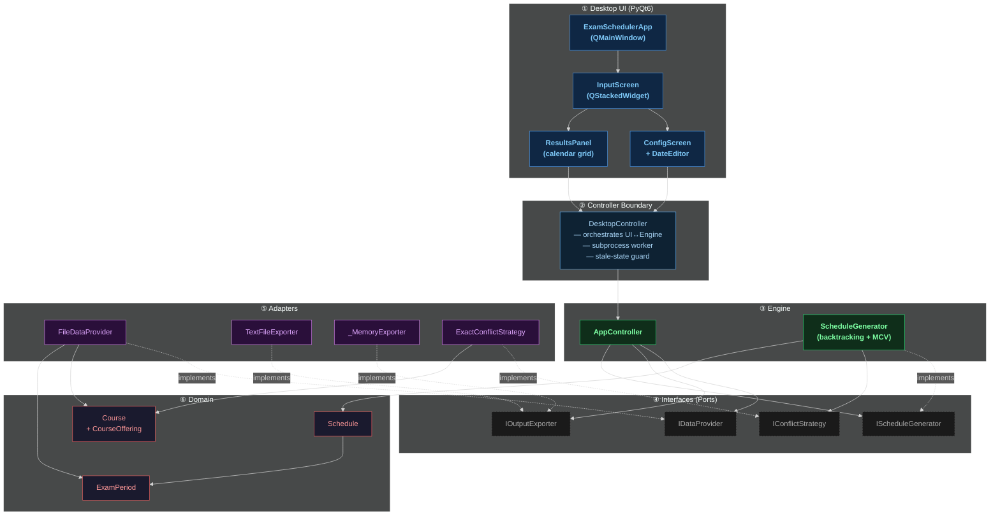
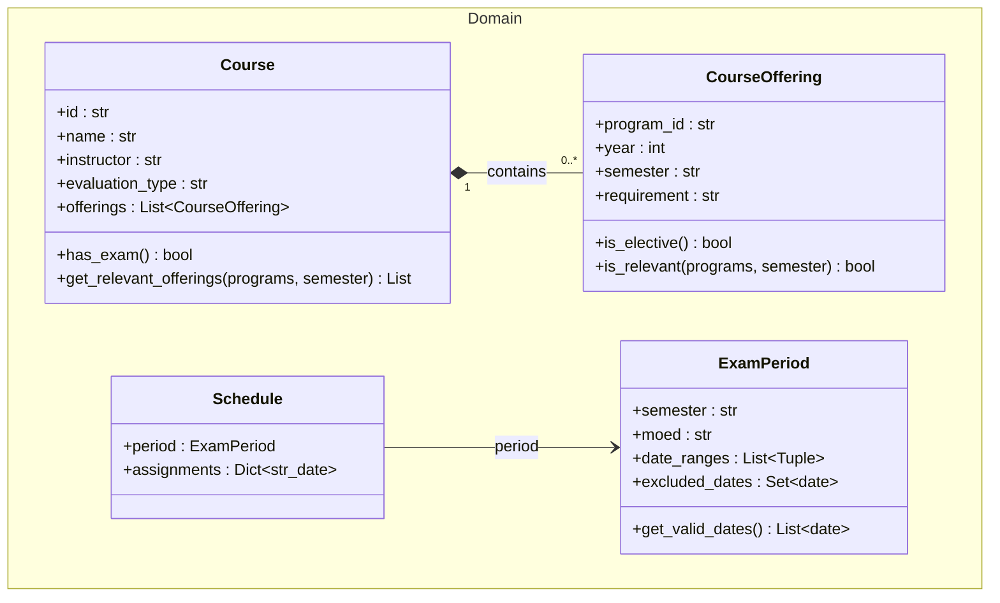
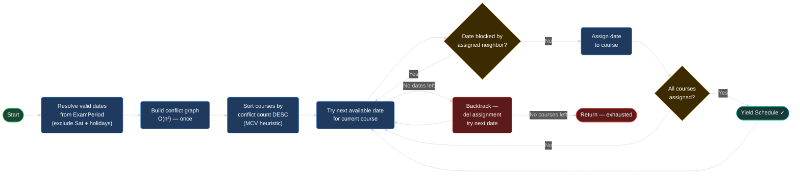

# Syncademic

> **University exam scheduler** — given a course catalog, exam windows, and a set of study programs, generates every valid conflict-free timetable using a backtracking CSP solver with an MCV heuristic.


---

## Table of Contents

- [Overview](#overview)
- [Quick Start](#quick-start)
- [Architecture](#architecture)
- [UI Workflow](#ui-workflow)
- [Domain Model](#domain-model)
- [Scheduling Algorithm](#scheduling-algorithm)
- [Project Structure](#project-structure)
- [Setup](#setup)
- [Usage](#usage)
- [Input File Formats](#input-file-formats)
- [Output Format](#output-format)
- [Testing](#testing)
- [What's New in v2.0](#whats-new-in-v20)

---

## Overview

Syncademic solves the exam timetabling problem as a **Constraint Satisfaction Problem (CSP)** and exposes it through a **PyQt6 desktop application**.

Key capabilities:

- Load a course catalog and exam-period windows from plain-text files
- Select up to five study programs through the desktop UI
- Edit exam-period date exclusions before generating
- Run a backtracking + MCV search to find all valid conflict-free schedules
- Browse results in an interactive calendar grid
- Export a selected schedule to a structured text file

| Property | Implementation |
|---|---|
| Architecture | Clean Architecture — 6 layers, Ports & Adapters |
| Primary interface | PyQt6 desktop application |
| Algorithm | Backtracking CSP + MCV heuristic |
| Memory model | Lazy `Iterator[Schedule]` — schedules are never all held in RAM |
| Conflict graph | Built once O(n²), reused across all backtrack steps |
| Generation | Runs in a `multiprocessing.Process`; UI stays responsive via `QTimer` polling |

---

## Quick Start

```bash
git clone <repo-url> && cd examSchedule
python -m venv venv && source venv/bin/activate
pip install -r requirements.txt
python main.py
```

The desktop application opens. Load `data/courses.txt` and `data/dates.txt`, select your programs, and click **Generate**.

---

## Architecture

Syncademic v2.0 is organised into **six strict layers**. Inner layers never import outer layers.



| Layer | Responsibility |
|---|---|
| **Desktop UI** | PyQt6 screens: file loading, program selection, date editing, generation progress, calendar results, export |
| **Controller** | `DesktopController` — bridges UI signals to engine calls, runs generation in a subprocess worker, enforces stale-state guard |
| **Engine** | `AppController` orchestrates a pipeline run; `ScheduleGenerator` runs the CSP solver |
| **Interfaces** | Abstract ports (ABCs) — engine depends only on these, never on concrete adapters |
| **Adapters** | Concrete implementations: `FileDataProvider`, `TextFileExporter`, `_MemoryExporter`, `ExactConflictStrategy` |
| **Domain** | Pure data containers (`Course`, `CourseOffering`, `ExamPeriod`, `Schedule`) — zero I/O |

### Subprocess Worker Pattern

Schedule generation is CPU-intensive. To keep the Qt event loop responsive, `DesktopController` spawns a `multiprocessing.Process` that communicates results back through a `multiprocessing.Queue`. A `QTimer` polling every 150 ms drains the queue and updates the UI without blocking.

```
ConfigScreen  ──signal──►  DesktopController  ──spawn──►  Worker Process
                                  ▲                              │
                              QTimer (150ms)  ◄──queue──  results / error
```

---

## UI Workflow

```
┌──────────────────────────────────────────────────────────────┐
│  1. Load Files                                               │
│     courses.txt  +  dates.txt  →  FileDataProvider          │
└──────────────────────────────────────────────────────────────┘
                          │
                          ▼
┌──────────────────────────────────────────────────────────────┐
│  2. Select Programs                                          │
│     Up to 5 programs · "View Courses ▶" per row             │
│     Optional: edit excluded dates per exam period            │
└──────────────────────────────────────────────────────────────┘
                          │
                          ▼
┌──────────────────────────────────────────────────────────────┐
│  3. Generate                                                 │
│     Subprocess worker runs CSP solver                        │
│     Progress spinner shown · up to 180 s timeout            │
└──────────────────────────────────────────────────────────────┘
                          │
                          ▼
┌──────────────────────────────────────────────────────────────┐
│  4. Browse Results                                           │
│     Calendar grid per semester/moed                          │
│     Click any cell → exam detail popup                       │
│     Page through schedules with ◀ / ▶ controls              │
└──────────────────────────────────────────────────────────────┘
                          │
                          ▼
┌──────────────────────────────────────────────────────────────┐
│  5. Export                                                   │
│     Save selected schedule to schedules.txt                  │
│     Blocked if inputs changed since last generation          │
└──────────────────────────────────────────────────────────────┘
```

---

## Domain Model



**Conflict rule** — two courses conflict when there exists a shared offering where `program_id`, `year`, and `semester` all match, and not both offerings are elective. Only offerings from **selected programs** are evaluated.

---

## Scheduling Algorithm



The generator is a lazy `Iterator[Schedule]` — it yields one valid schedule at a time without ever building the full list.

---

## Project Structure

```text
examSchedule/
├── main.py                          # Entry point — desktop GUI (default) or --cli
├── data/
│   ├── courses.txt                  # Course catalog with per-program offerings
│   ├── dates.txt                    # Exam periods, date ranges, and exclusions
│   └── programs.txt                 # Program IDs (CLI use)
├── src/
│   ├── controller.py                # DesktopController + _MemoryExporter + worker
│   ├── ui/                          # PyQt6 desktop application
│   │   ├── app.py                   # QMainWindow entry
│   │   ├── input_screen.py          # Main widget (QStackedWidget)
│   │   ├── config_screen.py         # File loading, program selection, generate button
│   │   ├── results_panel.py         # Calendar grid + QStyledItemDelegate
│   │   ├── date_editor.py           # Exam-period date exclusion editor
│   │   ├── exam_detail_dialog.py    # Per-date popup with 4-column table
│   │   ├── tokens.py                # Colour + spacing constants
│   │   ├── style.py                 # QSS loader with token substitution
│   │   └── stylesheet.qss           # Component styling (@COLOR_PRIMARY@ tokens)
│   ├── domain/                      # Pure data containers — zero I/O
│   │   ├── course.py
│   │   ├── course_offering.py
│   │   ├── exam_period.py
│   │   ├── schedule.py
│   │   └── semester.py
│   ├── interfaces/                  # Abstract ports
│   │   ├── i_data_provider.py
│   │   ├── i_conflict_strategy.py
│   │   ├── i_schedule_generator.py
│   │   └── i_output_exporter.py
│   ├── engine/                      # Core logic — depends only on interfaces
│   │   ├── app_controller.py
│   │   └── schedule_generator.py
│   └── adapters/                    # Concrete implementations
│       ├── exact_conflict_strategy.py
│       ├── file_data_provider.py
│       ├── in_memory_data_provider.py
│       ├── text_file_exporter.py
│       └── readers/
│           ├── course_file_reader.py
│           ├── exam_period_file_reader.py
│           └── program_selector_reader.py
├── tests/
│   ├── unit/                        # Domain, engine, adapters, UI smoke, controller
│   ├── e2e/                         # Full pipeline and desktop flow tests
│   └── conftest.py
├── requirements.txt                 # PyQt6>=6.6.0
└── requirements-dev.txt             # pytest, pylint, pytest-cov, pre-commit
```

---

## Setup

### 1. System libraries

**Linux only** — PyQt6 requires native graphics libraries that aren't bundled on Linux:

```bash
sudo apt-get update && sudo apt-get install -y \
  libegl1 libgl1 libgl1-mesa-glx \
  libxkbcommon0 libxkbcommon-x11-0 \
  libfontconfig1 libfreetype6 libdbus-1-3 libglib2.0-0 \
  libx11-6 libx11-xcb1 libxcb1 libxcb-cursor0 libxcb-icccm4 \
  libxcb-image0 libxcb-keysyms1 libxcb-randr0 libxcb-render-util0 \
  libxcb-shape0 libxcb-xfixes0 libxcb-xinerama0 libxcb-xkb1
```

**macOS / Windows** — all libraries are bundled with the PyQt6 wheel. Skip this step.

### 2. Python environment

Requires **Python 3.10 or later**. Download from [python.org](https://www.python.org/downloads/) if not installed.

**macOS / Linux:**
```bash
cd examSchedule
python3 -m venv venv
source venv/bin/activate
```

**Windows (Command Prompt):**
```cmd
cd examSchedule
python -m venv venv
venv\Scripts\activate.bat
```

**Windows (PowerShell):**
```powershell
cd examSchedule
python -m venv venv
venv\Scripts\Activate.ps1
```

> If PowerShell blocks the script, run `Set-ExecutionPolicy -Scope CurrentUser RemoteSigned` once first.

### 3. Install dependencies

```bash
pip install -r requirements.txt       # runtime: PyQt6
pip install -r requirements-dev.txt   # dev: pytest, pylint, coverage, pre-commit
```

---

## Usage

### Desktop application (primary)

**macOS / Linux:**
```bash
python main.py
```

**Windows:**
```cmd
python main.py
```

Opens the PyQt6 GUI. No arguments required.

### Headless CLI (backward-compatible)

**macOS / Linux:**
```bash
python main.py --cli \
  --programs data/programs.txt \
  --courses  data/courses.txt \
  --periods  data/dates.txt \
  --output   output/schedules.txt
```

**Windows:**
```cmd
python main.py --cli ^
  --programs data\programs.txt ^
  --courses  data\courses.txt ^
  --periods  data\dates.txt ^
  --output   output\schedules.txt
```

Runs the original file-to-file pipeline without launching any UI. Useful for scripting and CI.

### Running tests

**macOS / Linux:**
```bash
QT_QPA_PLATFORM=offscreen python -m pytest tests/ -v
```

**Windows:**
```cmd
set QT_QPA_PLATFORM=offscreen && python -m pytest tests/ -v
```

**Windows (PowerShell):**
```powershell
$env:QT_QPA_PLATFORM="offscreen"; python -m pytest tests/ -v
```

---

## Input File Formats

### `courses.txt`

Records separated by `$$$$`. Each record: name → ID → instructor → offering lines → evaluation type.

```text
$$$$
Calculus 1
83112
Dr. Erez Scheiner
83101, 1, FALL, Obligatory
83102, 1, FALL, Obligatory
Exam
$$$$
```

Evaluation types: `Exam` | `Project` | `Attendance`. Only `Exam` courses are scheduled.

### `dates.txt`

Exam-period records separated by `$$$$`.

```text
$$$$
FALL, Aleph
29-01-2026, 11-03-2026
- 14-02-2026
- 02-03-2026, 04-03-2026  Purim
$$$$
```

Semesters: `FALL` | `SPRI` | `SUMM`. Moeds: `Aleph` | `Bet` | `Gimel`. Saturdays excluded automatically.

### `programs.txt` (CLI only)

Comma-separated 5-digit program IDs:

```text
83101, 83102, 83108
```

---

## Output Format

```text
=== SEMESTER: FALL ===
--- Moed: Aleph ---

Schedule #1:
  - Physics 1    | Course ID: 83102 | Date: 29-01-2026 | Instructor: Prof. O. Some
  - Calculus 1   | Course ID: 83112 | Date: 30-01-2026 | Instructor: Dr. Erez Scheiner

Schedule #2:
  - Physics 1    | Course ID: 83102 | Date: 29-01-2026 | Instructor: Prof. O. Some
  - Calculus 1   | Course ID: 83112 | Date: 01-02-2026 | Instructor: Dr. Erez Scheiner
```

If a period yields no valid schedules the block reads `No valid schedules found.`

---

## Testing

On macOS/Linux, prefix Qt tests with `QT_QPA_PLATFORM=offscreen`. On Windows use `set QT_QPA_PLATFORM=offscreen &&` (CMD) or `$env:QT_QPA_PLATFORM="offscreen";` (PowerShell). See [Running tests](#running-tests) above for platform-specific one-liners.

```bash
# Full suite
QT_QPA_PLATFORM=offscreen python -m pytest tests/ -v

# Unit tests only
python -m pytest tests/unit/ -v

# E2E only
python -m pytest tests/e2e/ -v

# UI smoke + integration only
QT_QPA_PLATFORM=offscreen python -m pytest \
  tests/unit/test_ui_smoke.py \
  tests/unit/test_ui_controller_integration.py -v

# With coverage report
pytest --cov=src --cov-report=term-missing
```

**210 tests · all passing · 90% coverage**

| Suite | Scope |
|---|---|
| Unit | Domain, readers, adapters, scheduling logic, conflict strategy, controller state |
| UI smoke | App launches, config screen renders, main controls visible |
| UI-controller integration | UI actions update controller state; generation and export triggered correctly |
| E2E | Full flows: load files → select programs → generate → browse → export |
| Edge cases | Empty files, invalid data, >5 programs, repeated navigation, stale-state prevention |

---

## What's New in v2.0

| Area | Change |
|---|---|
| **Desktop UI** | Full PyQt6 app — config screen, exam period editor, paginated calendar results |
| **DesktopController** | Dedicated controller layer bridging UI and engine; isolates all subprocess/queue logic |
| **Subprocess worker** | Generation runs in `multiprocessing.Process`; UI never blocks |
| **Stale-state guard** | Export blocked when inputs changed since last generation; user notified |
| **_MemoryExporter** | In-memory adapter captures results without writing to disk during generation |
| **Per-programme drill-down** | "View Courses ▶" button per programme row |
| **Date editor** | Multi-range date editor widget with excluded-days support (pre-generation only) |
| **Design token system** | `tokens.py` + `stylesheet.qss` with `@COLOR_PRIMARY@` substitution |
| **Tests** | 210 tests at 90% coverage (was 15 tests in v1.0) |
| **CI** | GitHub Actions with 85% coverage gate + pylint ≥ 8.5 |
