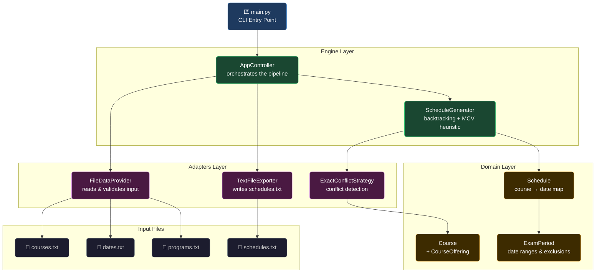
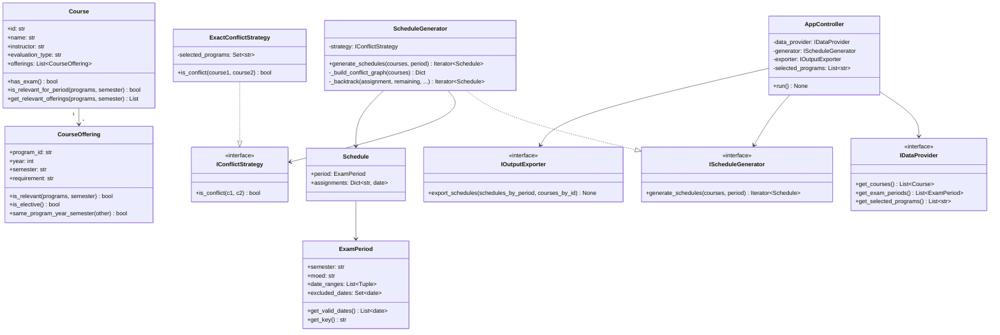
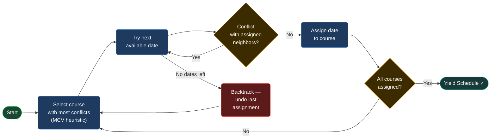

# examSchedule


---

## What It Does

Given a set of courses, exam windows, and selected study programs, `examSchedule` generates every valid conflict-free exam schedule — ensuring no student in a selected program sits two exams on the same day.

The engine uses a **conflict graph** + **Most-Constrained-Variable (MCV) heuristic** to prune the backtracking search space, producing results lazily without loading all schedules into memory.

---

## Architecture



---

## UML Class Diagram



---

## Scheduling Algorithm



---

## Project Structure

```
examSchedule/
├── main.py                        # CLI entry point (argparse wiring)
├── data/
│   ├── courses.txt                # Course catalog with offerings
│   ├── dates.txt                  # Exam periods, date ranges, exclusions
│   └── programs.txt               # Selected program IDs (up to 5)
├── src/
│   ├── domain/                    # Pure domain entities — no I/O
│   │   ├── course.py
│   │   ├── course_offering.py
│   │   ├── exam_period.py
│   │   ├── schedule.py
│   │   └── semester.py
│   ├── interfaces/                # Abstract ports (ABC)
│   │   ├── i_data_provider.py
│   │   ├── i_conflict_strategy.py
│   │   ├── i_schedule_generator.py
│   │   └── i_output_exporter.py
│   ├── engine/                    # Core logic — depends only on interfaces
│   │   ├── app_controller.py
│   │   └── schedule_generator.py
│   └── adapters/                  # Concrete implementations
│       ├── exact_conflict_strategy.py
│       ├── file_data_provider.py
│       ├── text_file_exporter.py
│       └── readers/
│           ├── course_file_reader.py
│           ├── exam_period_file_reader.py
│           └── program_selector_reader.py
└── tests/
    ├── unit/                      # 74 tests — fast, no pipeline
    └── e2e/                       # 10 tests — full pipeline, real + synthetic data
```

---

## Setup

```bash
python3 -m venv .venv
source .venv/bin/activate
pip install pytest
```

---

## Usage

```bash
.venv/bin/python main.py \
  --programs data/programs.txt \
  --courses  data/courses.txt \
  --periods  data/dates.txt \
  --output   data/schedules.txt
```

---

## Input File Formats

**programs.txt** — up to 5 comma-separated 5-digit program IDs:
```
83101, 83102, 83108
```

**courses.txt** — records separated by `$$$$`:
```
Calculus 1
83112
Dr. Erez Scheiner
83101, 1, FALL, Obligatory
Exam
$$$$
```

**dates.txt** — exam period records separated by `$$$$`:
```
FALL, Aleph
29-01-2026, 11-03-2026
- 14-02-2026
$$$$
```

---

## Running Tests

```bash
.venv/bin/python -m pytest tests/ -v
```

**84 test functions · 89 pytest runs · all passing**

| Layer | Tests | Focus |
|-------|-------|-------|
| Unit | 74 | Per-class, no pipeline I/O |
| E2E | 10 | Full pipeline, real + synthetic data |
