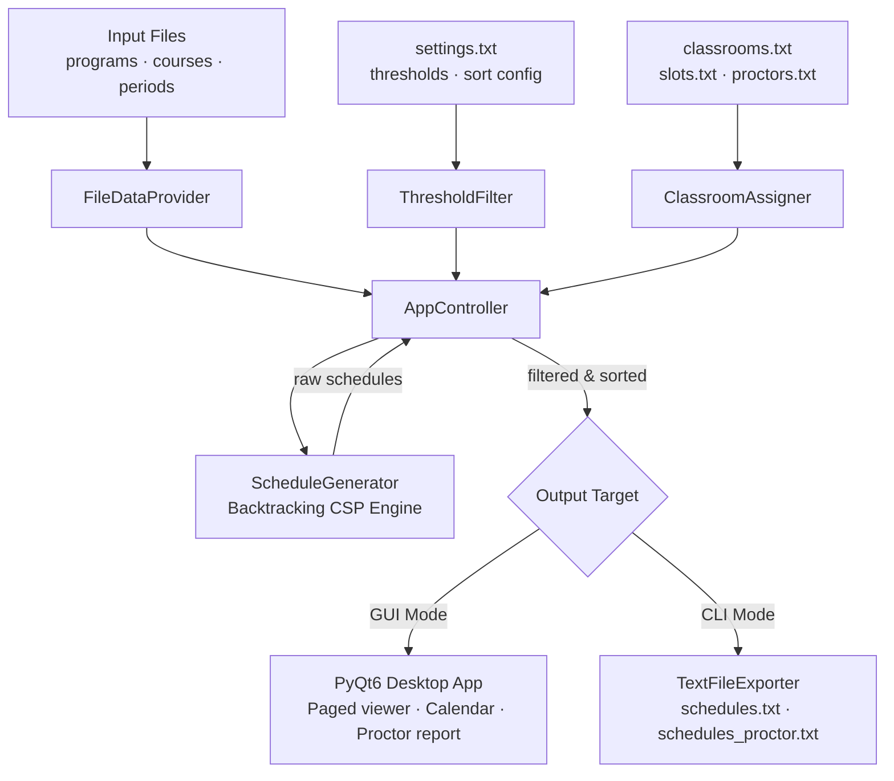
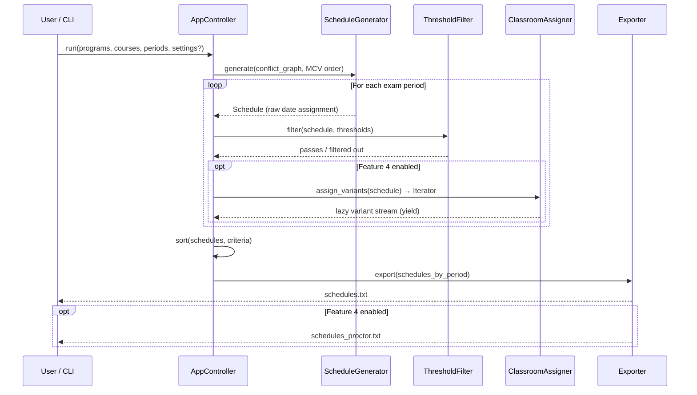
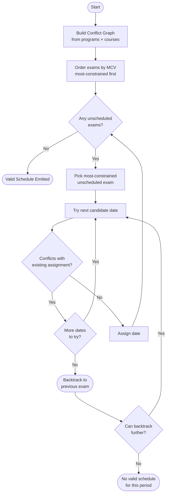
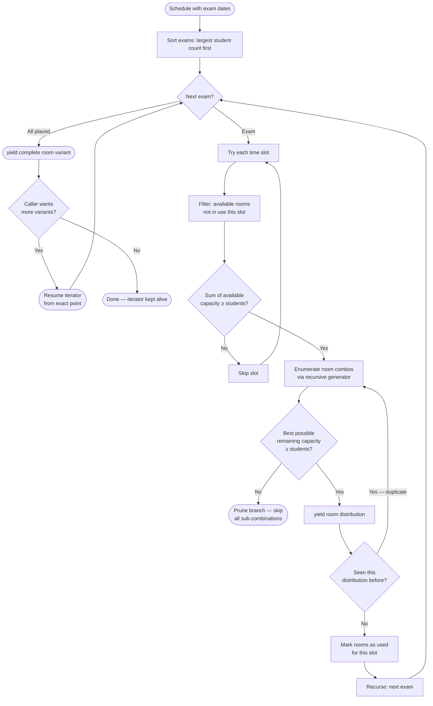

<div align="center">

# Exam Scheduling System

### *Syncademic — Solving the NP-Hard Exam Scheduling Problem*

[](https://python.org)
[](#)
[](#running-the-test-suite)
[](https://pypi.org/project/PyQt6/)
[](LICENSE)

**An enterprise-grade, constraint-driven exam scheduler with an intelligent backtracking engine,**  
**a polished PyQt6 desktop GUI, and a fully parity headless CLI.**

</div>

---

## Overview

University exam scheduling is a classic **NP-Hard Constraint Satisfaction Problem (CSP)**. With hundreds of courses, dozens of programs, overlapping enrollments, and limited physical resources, manual[...]

**Syncademic** automates this entirely. It ingests your program, course, and period data, applies a backtracking engine with intelligent pruning, and produces every valid schedule variant — ranked a[...]

### Core Capabilities

| Capability | Description |
|---|---|
| **Conflict-Free Scheduling** | Guarantees no student sits two exams on the same day |
| **Phase 3 — Optimal Sorting** | Multi-criteria ranking: min gaps, spread, daily load, elective collisions |
| **Feature 4 — Classroom Assignment** | Strict room allocation with capacity splitting and proctor calculation |
| **GUI & CLI Parity** | Every feature accessible from the desktop app or the headless batch CLI |
| **Import Schedules** | Load previously generated output files back into the GUI for review |
| **Auto-Variants** | Lazy pagination of classroom allocation variants — no freeze, no data loss |

---

## Architecture & Data Flow



### Generation Pipeline — Sequence Diagram



---

## Under the Hood: Algorithms

### Constraint Satisfaction via Backtracking

The core date-assignment engine is a **Recursive DFS with intelligent pruning**. Before placing an exam on a date, it checks a pre-built **Conflict Graph** — a mapping from every course to the set o[...]

The engine applies the **Most Constrained Variable (MCV) heuristic**: exams with more conflicts are scheduled first, dramatically reducing the search tree. Any partial assignment that would produce a [...]



### Phase 3: Multi-Criteria Sorting

Once raw schedules are generated, Phase 3 applies threshold filtering and multi-criteria sorting without regenerating schedules:

| Sort Criterion | Strategy |
|---|---|
| Min days between mandatory exams | Descending — maximise breathing room |
| Avg days between any exams | Descending — spread load evenly |
| Elective collision count | Descending — surface schedules with fewest elective clashes |
| Exam period spread | Descending — favour schedules with wider overall spread |
| Max exams on the same day | Descending — penalise dense days |

Criteria can be combined and reordered in real time from the GUI without triggering a regeneration pass.

### Feature 4: True Lazy Classroom Assignment

Classroom assignment is where combinatorial explosion becomes a real danger. With *R* rooms and *E* exams per day, a naïve approach generates `O(2^R)` room combinations, which is completely impractic[...]

Syncademic's `ClassroomAssigner` avoids this entirely through **True Lazy Evaluation**:

1. **Capacity-Based Pruning** — Before recursing into any branch, the engine checks whether the best remaining rooms can *possibly* satisfy the exam's student count. Impossible branches are cut befo[...]
2. **Generator-Based DFS** — Room combinations are produced one at a time via Python `yield`. The caller (UI or CLI) consumes exactly as many variants as it needs. No variant is ever computed until [...]
3. **Deduplication** — A `seen` set of distribution keys prevents the same room-to-student allocation from appearing twice, even when different room combinations produce identical splits.
4. **Largest-Exam-First Ordering** — Within each day, larger exams are assigned rooms first. This maximises the chance that a valid allocation exists for smaller exams by reserving fewer rooms for t[...]

> **Result:** The GUI fetches classroom variants in pages at `O(1)` perceived latency. The full variant space is never materialised in memory. Iterators are kept alive between page requests and resume[...]



### Proctor Calculation

Proctor count per room is computed as `⌈students_in_room / X⌉` where *X* is the ratio denominator from your `proctors.txt` file. This is applied at assignment time and written to [...]

---

## Installation & Setup

### Prerequisites

- Python **3.10** or higher
- `pip` package manager

### 1. Clone the Repository

```bash
git clone https://github.com/ron-ladin/examSchedule.git
cd examSchedule
```

### 2. Create a Virtual Environment

<details open>
<summary><strong>macOS / Linux</strong></summary>

```bash
python3 -m venv .venv
source .venv/bin/activate
```
</details>

<details>
<summary><strong>Windows (PowerShell)</strong></summary>

```powershell
python -m venv .venv
.venv\Scripts\Activate.ps1
```
</details>

<details>
<summary><strong>Windows (Command Prompt)</strong></summary>

```cmd
python -m venv .venv
.venv\Scripts\activate.bat
```
</details>

### 3. Install Dependencies

```bash
pip install -r requirements.txt
```

> The only runtime dependency is **PyQt6 ≥ 6.6.0**. Development dependencies (pytest, coverage) live in `requirements-dev.txt`.

---

## Running the Application

### GUI Mode (Desktop App)

Launch the full PyQt6 desktop application:

```bash
python main.py
```

The GUI provides:
- **File browsers** for all input data with real-time validation
- **Time slot validator** — enforces HH:MM (24h), max 3 per day, ascending order, minimum 4-hour gap
- **Paged schedule viewer** with calendar visualisation
- **Import Schedule** — load a previously exported `schedules.txt` back into the viewer
- **Auto-Variants** — automatically page through classroom allocation variants without freezing
- **Proctor Report viewer** — inspect per-room proctor assignments per schedule inline

```
╔══════════════════════════════════════════════════════════════════════════════════╗
║  Syncademic — Exam Scheduling System                              [− □ ✕]      ║
╠══════════════════════════════════════════════════════════════════════════════════╣
║  INPUT FILES                              FEATURE 4 — CLASSROOM ASSIGNMENT      ║
║  ┌──────────────────────────────────┐     ┌─────────────────────────────────┐   ║
║  │ Programs:  [data/programs.txt  ] │     │ Classrooms: [classrooms.txt   ] │   ║
║  │ Courses:   [data/courses.txt   ] │     │ Time Slots: 08:00, 12:00, 16:00 │   ║
║  │ Periods:   [data/dates.txt     ] │     │ Proctor:    1:30                │   ║
║  └──────────────────────────────────┘     └─────────────────────────────────┘   ║
║                                                                                  ║
║  PHASE 3 — SORTING & THRESHOLDS            [ Import Schedule ]  [ Generate ]    ║
║  ☑ Min gap between mandatory exams                                               ║
║  ☑ Avg gap between all exams                                                     ║
║  ☑ Elective collision count                                                      ║
╠══════════════════════════════════════════════════════════════════════════════════╣
║  SCHEDULE #3  of  47          [ ◀ Prev ]  [ Next ▶ ]  [ Auto-Variants: ON  ]   ║
║  ┌──────────────────────────────────────────────────────────────────────────┐   ║
║  │  Semester A — Winter 2025                                                │   ║
║  │                                                                          │   ║
║  │  Sun 12-Jan   Calculus I  · Intro to CS                                 │   ║
║  │  Mon 13-Jan   ─                                                          │   ║
║  │  Tue 14-Jan   Linear Algebra  · Discrete Math                           │   ║
║  │  Wed 15-Jan   ─                                                          │   ║
║  │  Thu 16-Jan   Data Structures                                            │   ║
║  │  Sun 19-Jan   Operating Systems  · Algorithms                           │   ║
║  │                                                                          │   ║
║  │  Min gap: 2d  ·  Avg gap: 2.4d  ·  Max/day: 2  ·  Collisions: 0        │   ║
║  └──────────────────────────────────────────────────────────────────────────┘   ║
║  [ View Proctor Report ]  [ Export Schedules ]   535 tests · all passing        ║
╚══════════════════════════════════════════════════════════════════════════════════╝
```

---

### Headless CLI Mode

All three modes share the same four required arguments:

| Argument | Description |
|---|---|
| `--programs` | Path to programs file (comma-separated 5-digit IDs) |
| `--courses` | Path to courses file |
| `--periods` | Path to exam periods file |
| `--output` | Path for the generated output file |

---

#### Mode 1 — Base (Standard Date Scheduling)

```bash
python main.py \
  --programs  data/programs.txt \
  --courses   data/courses.txt \
  --periods   data/dates.txt \
  --output    output/schedules.txt
```

---

#### Mode 2 — Phase 3 (Threshold Filtering + Multi-Criteria Sorting)

Adds threshold filtering and multi-criteria sorting. Results are capped at 10,000 combinations to prevent unbounded output files.

```bash
python main.py \
  --programs  data/programs.txt \
  --courses   data/courses.txt \
  --periods   data/dates.txt \
  --output    output/schedules.txt \
  --settings  data/settings.txt
```

---

#### Mode 3 — Feature 4 (Classroom Assignment + Proctor Report)

Assigns rooms and time slots to every exam. Produces two output files: `schedules.txt` and `schedules_proctor.txt`.

> **All three Feature 4 flags are required together.** Omitting any one will abort with a clear error message.

```bash
python main.py \
  --programs    data/programs.txt \
  --courses     data/courses.txt \
  --periods     data/dates.txt \
  --output      output/schedules.txt \
  --classrooms  data/classrooms.txt \
  --slots       data/slots.txt \
  --proctor     data/proctors.txt
```

You may combine `--settings` with Feature 4 flags to apply sorting and threshold filtering before room assignment.

---

## Running the Test Suite

```bash
pip install -r requirements-dev.txt
pytest
```

To run with line-by-line coverage reporting:

```bash
pytest --cov=src --cov-report=term-missing
```

The suite contains **535 tests** across three layers:

- **Unit tests** — every domain model, algorithm component, and reader class
- **Integration tests** — full generation pipeline for all three CLI modes
- **Regression guards** — lazy evaluation correctness, deduplication, proctor ratio edge cases, capacity overflow handling

> All 535 tests pass on a clean checkout. Any failure blocks the merge.

---

## Project Structure

```
examSchedule/
├── main.py                        # Entry point — GUI or CLI dispatch
├── src/
│   ├── adapters/                  # File readers, exporters, conflict strategies
│   │   └── readers/               # Per-filetype reader classes
│   ├── domain/                    # Pure domain models (Course, Schedule, Threshold…)
│   ├── engine/                    # Core algorithms
│   │   ├── app_controller.py      # Orchestrates the full generation pipeline
│   │   ├── schedule_generator.py  # Backtracking CSP engine with MCV heuristic
│   │   ├── classroom_assigner.py  # Lazy room-assignment with capacity pruning
│   │   └── proctor_report.py      # Proctor report builder
│   └── ui/                        # PyQt6 desktop application
├── tests/                         # 535 pytest tests
├── data/                          # Sample input files
└── output/                        # Generated schedules land here
```

---

## License

This project is licensed under the **MIT License** — see the [LICENSE](LICENSE) file for details.

---

<div align="center">

Built by the Syncademic team.

</div>
