# SDD Foundation Document - Exam Scheduling System

**Audit Date:** 2026-05-19
**Repository:** `examSchedule`
**Branch at Audit:** `develop`
**Auditor:** Claude Code (automated technical audit)

> **Note:** This document reflects the `develop` branch. The `main` branch is an earlier snapshot; the differences are significant -- see Section 7 for a summary of what changed.

---

## Table of Contents

1. [Project Structure Survey](#1-project-structure-survey)
2. [Class & Module Inventory](#2-class--module-inventory)
3. [Relationships & Architecture](#3-relationships--architecture)
4. [Core Algorithms](#4-core-algorithms)
5. [Data Models](#5-data-models)
6. [Interfaces & Contracts](#6-interfaces--contracts)
7. [Gaps & Open Questions](#7-gaps--open-questions)

---

## 1. Project Structure Survey

### 1.1 Full Directory Tree

```
examSchedule/
|-- main.py                          # CLI entry point -- wires all dependencies, calls controller.run()
|-- README.md                        # Project overview, input file formats, usage instructions
|-- BRANCHING.md                     # Git Flow branching strategy documentation
|-- .gitignore                       # Standard Python ignores
|
|-- data/                            # Runtime input/output data (not source code)
|   |-- courses.txt                  # Input: course catalogue ($$$$-separated records)
|   |-- dates.txt                    # Input: exam period windows with exclusions
|   |-- programs.txt                 # Input: selected program IDs (comma-separated, max 5)
|   `-- schedules.txt                # Output: generated exam schedules (written by TextFileExporter)
|
|-- src/                             # Application source code package
|   |-- __init__.py
|   |
|   |-- domain/                      # Pure domain entities -- no I/O, no framework dependencies
|   |   |-- __init__.py              # Exports: Course, CourseOffering, ExamPeriod, Schedule + semester utils
|   |   |-- course.py                # @dataclass(eq=False) Course -- university course entity
|   |   |-- course_offering.py       # @dataclass(frozen=True) CourseOffering -- program enrollment
|   |   |-- exam_period.py           # @dataclass ExamPeriod -- date window with Saturday auto-exclusion
|   |   |-- schedule.py              # @dataclass Schedule -- one complete assignment of courses to dates
|   |   `-- semester.py              # Utility: semester normalization constants and functions
|   |
|   |-- interfaces/                  # Abstract contracts -- no implementations
|   |   |-- __init__.py              # Exports: IDataProvider, IConflictStrategy, IOutputExporter, IScheduleGenerator
|   |   |-- i_data_provider.py       # ABC: source of courses, periods, programs
|   |   |-- i_conflict_strategy.py   # ABC: conflict-detection rule (no date param in updated signature)
|   |   |-- i_output_exporter.py     # ABC: output destination contract
|   |   `-- i_schedule_generator.py  # ABC: schedule generation contract [NEW on develop]
|   |
|   |-- adapters/                    # Concrete infrastructure implementations
|   |   |-- __init__.py              # Exports: ExactConflictStrategy, FileDataProvider, TextFileExporter
|   |   |-- exact_conflict_strategy.py   # IConflictStrategy: v1.0 conflict rule (no exam_date param)
|   |   |-- file_data_provider.py        # IDataProvider: delegates to file readers
|   |   |-- text_file_exporter.py        # IOutputExporter: writes human-readable .txt output
|   |   |
|   |   `-- readers/                     # File-parsing utilities (not exposed as interfaces)
|   |       |-- __init__.py              # Exports: CourseFileReader, ExamPeriodFileReader, ProgramSelectorReader
|   |       |-- course_file_reader.py    # Parses courses.txt -> List[Course]; validates unique IDs
|   |       |-- exam_period_file_reader.py  # Parses dates.txt -> List[ExamPeriod]
|   |       `-- program_selector_reader.py  # Parses programs.txt -> List[str]; validates uniqueness
|   |
|   `-- engine/                      # Orchestration and algorithm layer
|       |-- __init__.py
|       |-- app_controller.py        # AppController -- coordinates data->generate->export pipeline
|       `-- schedule_generator.py    # ScheduleGenerator (implements IScheduleGenerator) -- backtracking + MCV
|
`-- tests/                           # Test suite
    |-- __init__.py
    |-- unit/                        # Unit tests -- ALL fully implemented on develop
    |   |-- __init__.py
    |   |-- test_conflict_strategy.py     # 148 lines -- ExactConflictStrategy
    |   |-- test_course.py                # 131 lines -- Course domain entity [NEW]
    |   |-- test_course_offering.py       # 74 lines  -- CourseOffering [NEW]
    |   |-- test_exam_period.py           # 147 lines -- ExamPeriod (incl. Saturday exclusion)
    |   |-- test_file_data_provider.py    # 305 lines -- FileDataProvider + readers
    |   |-- test_schedule.py              # 62 lines  -- Schedule [NEW]
    |   |-- test_schedule_generator.py    # 225 lines -- ScheduleGenerator [NEW]
    |   `-- test_text_file_exporter.py    # ~175 lines -- TextFileExporter
    `-- e2e/                         # End-to-end tests -- fully implemented on develop
        |-- __init__.py
        `-- test_full_pipeline.py    # 674 lines -- 20+ integration tests incl. real data
```

### 1.2 Entry Points

| Entry Point | File | Description |
|---|---|---|
| **CLI** | `main.py` | `main()` -- parses args, wires all concrete adapters, calls `controller.run()` |
| **Programmatic** | Any caller | Can instantiate `AppController` directly with injected dependencies |

### 1.3 Technology Stack

| Concern | Technology |
|---|---|
| Language | Python 3.7+ |
| Type system | `typing` module (List, Dict, Set, Tuple, Iterable, Iterator, TYPE_CHECKING) |
| Domain entities | `dataclasses` (`@dataclass`, `@dataclass(eq=False)`, `@dataclass(frozen=True)`) |
| Abstract interfaces | `abc.ABC` + `abc.abstractmethod` |
| File paths | `pathlib.Path` |
| Date arithmetic | `datetime.date`, `datetime.timedelta`, `datetime.datetime` |
| Weekday detection | `date.weekday()` -- Saturday = 5 |
| CLI | `argparse` |
| Logging | `logging` module (no `print()` anywhere in source) |
| Testing | `pytest` (with `tmp_path`, `caplog` fixtures; `pytest.raises`) |
| External dependencies | **None** -- standard library only |
| Build / packaging | **None** -- no `requirements.txt`, `pyproject.toml`, or `setup.py` |
| Configuration | **None** -- all paths passed via CLI arguments |

### 1.4 Input/Output File Formats

#### `programs.txt`
```
Comma-separated 5-digit program IDs (1-5 unique entries)
Example:  83101, 83102, 83108
Validation: no duplicates; each must appear in at least one course offering
```

#### `courses.txt`
```
Records separated by $$$$
Each record requires at least 5 lines:
  Line 0      : course name
  Line 1      : 5-digit course ID (must be unique across file)
  Line 2      : instructor name
  Lines 3..N-2: offering lines -> "program_id, year, semester, requirement"
  Line N-1    : evaluation type (Exam / Project / Attendance)
```

#### `dates.txt`
```
Records separated by $$$$
Each record:
  Line 0   : "SEMESTER, MOED"   (e.g. "FALL, Aleph")
  Line 1   : "START_DATE, END_DATE" -- start <= end allowed (same-day range valid)
  Lines 2+  : excluded date or range, optionally prefixed with "-"
Date format: DD-MM-YYYY
Note: Saturdays are automatically excluded -- no need to list them
```

#### `schedules.txt` (output)
```
=== SEMESTER: FALL ===
--- Moed: Aleph ---

Schedule #1:
  - <Course Name> | Course ID: <id> | Date: DD-MM-YYYY | Instructor: <Name>
  - ...

Schedule #2:
  - ...

No valid schedules found.    <- when zero schedules exist for a period
No exam periods found.       <- when schedules_by_period is empty
```

Periods appear in sorted order: FALL -> SPRING -> SUMMER, and within each semester: Aleph -> Bet -> Gimel.

---

## 2. Class & Module Inventory

### 2.1 Domain Layer (`src/domain/`)

---

#### `Course` -- `src/domain/course.py`

**Type:** `@dataclass(eq=False)` (mutable; equality and hash manually defined)
**Responsibility:** Represents a university course including its multi-program enrollment structure.

**Attributes:**

| Name | Type | Description |
|---|---|---|
| `id` | `str` | Unique 5-digit course identifier |
| `name` | `str` | Full course name |
| `instructor` | `str` | Instructor name |
| `evaluation_type` | `str` | `"Exam"` or `"Project"` or `"Attendance"` |
| `offerings` | `List[CourseOffering]` | All program/year/semester enrollments (default: `[]`) |

**Methods:**

| Signature | Returns | Description |
|---|---|---|
| `__eq__(self, other: object)` | `bool` | `isinstance(other, Course) and self.id == other.id` |
| `__hash__(self)` | `int` | `hash(self.id)` -- consistent with `__eq__` |
| `add_offering(self, offering: CourseOffering)` | `None` | Appends to `self.offerings` |
| `has_exam(self)` | `bool` | `True` if `evaluation_type.lower() == "exam"` |
| `get_relevant_offerings(self, selected_programs: List[str], semester: str)` | `List[CourseOffering]` | Filters offerings by selected programs and normalized semester |
| `is_relevant_for_period(self, selected_programs: List[str], semester: str)` | `bool` | `has_exam() AND len(get_relevant_offerings(...)) > 0` |

**Note on `eq=False` + explicit `__eq__`:** `@dataclass(eq=False)` prevents the auto-generated field-by-field `__eq__`. The manually defined `__eq__` compares only by `id`, which is now consistent with `__hash__`. This fixes the `main` branch bug where `__hash__` used `id` but auto-generated `__eq__` compared all fields (including the mutable `offerings` list).

**Removed from `main`:** `is_elective_for()` -- deleted. Elective checking now happens entirely inside `ExactConflictStrategy` via `CourseOffering.is_elective()`.

---

#### `CourseOffering` -- `src/domain/course_offering.py`

**Type:** `@dataclass(frozen=True)` (immutable, hashable) -- unchanged from `main`
**Responsibility:** Represents one program's enrollment in a course for a specific year and semester.

**Attributes:**

| Name | Type | Description |
|---|---|---|
| `program_id` | `str` | 5-digit program code (e.g. `"83101"`) |
| `year` | `int` | Study year within the program (1-4) |
| `semester` | `str` | Stored as internal format: `"FALL"` or `"SPRI"` or `"SUMM"` |
| `requirement` | `str` | `"Obligatory"` or `"Elective"` |

**Methods:**

| Signature | Returns | Description |
|---|---|---|
| `is_relevant(self, selected_programs: List[str], semester: str)` | `bool` | `program_id in selected_programs AND normalized semesters match` |
| `same_program_year_semester(self, other: CourseOffering)` | `bool` | `True` if same `program_id`, `year`, and normalized `semester` |
| `is_elective(self)` | `bool` | `True` if `requirement.lower() == "elective"` |

---

#### `ExamPeriod` -- `src/domain/exam_period.py`

**Type:** `@dataclass` (mutable -- changed from `frozen=True` on `main`)
**Responsibility:** Represents an exam window with automatic Saturday exclusion plus explicit holiday exclusions.

**Attributes:**

| Name | Type | Description |
|---|---|---|
| `semester` | `str` | `"FALL"` or `"SPRI"` or `"SUMM"` |
| `moed` | `str` | `"Aleph"` or `"Bet"` or `"Gimel"` |
| `date_ranges` | `List[Tuple[date, date]]` | Inclusive `(start, end)` date ranges |
| `excluded_dates` | `Set[date]` | Explicitly excluded dates (holidays etc.) -- Saturdays excluded automatically |

**Methods:**

| Signature | Returns | Description |
|---|---|---|
| `get_valid_dates(self)` | `List[date]` | All dates in `date_ranges` passing `_is_excluded_date()`, ascending order |
| `_is_excluded_date(self, exam_date: date)` | `bool` | `exam_date in self.excluded_dates OR _is_saturday(exam_date)` |
| `_is_saturday(self, exam_date: date)` | `bool` | `exam_date.weekday() == 5` |
| `get_key(self)` | `str` | `f"{normalize_semester(semester)} - {moed}"` e.g. `"FALL - Aleph"` |

**Key behavior change from `main`:** Saturdays (`weekday() == 5`) are now automatically excluded. Input files no longer need to explicitly list Saturdays. Sundays and Fridays are **not** automatically excluded.

**Mutability change:** `frozen=True` was removed. `ExamPeriod` instances are still constructed once and never mutated in the current codebase, but the immutability guarantee is gone.

---

#### `Schedule` -- `src/domain/schedule.py`

**Type:** `@dataclass` (mutable) -- trimmed on `develop`
**Responsibility:** Pure data container representing one complete assignment of courses to exam dates within a single period.

**Attributes:**

| Name | Type | Description |
|---|---|---|
| `period` | `ExamPeriod` | The exam period this schedule belongs to |
| `assignments` | `Dict[str, date]` | `course_id -> exam_date` mapping (default: `{}`) |

**Methods:** None. `Schedule` is a plain data container with no behaviour methods.

**Removed from `main`:** `add_assignment()`, `remove_assignment()`, `clone()` -- these were unused dead code on `main` (the backtracker built the assignments dict directly). Cleaned up on `develop`. The `from src.domain.course import Course` import was also removed.

---

#### `semester.py` -- `src/domain/semester.py`

**Type:** Module (constants + pure functions) -- unchanged from `main`
**Responsibility:** Canonical conversion between all accepted semester string variants and the internal 4-letter codes.

**Constants:**

| Name | Type | Value |
|---|---|---|
| `VALID_INTERNAL_SEMESTERS` | `set[str]` | `{"FALL", "SPRI", "SUMM"}` |
| `SEMESTER_ALIASES` | `Dict[str, str]` | Maps `FALL/SPRING/SPRI/SUMMER/SUMM` (upper-cased) to internal code |
| `SEMESTER_DISPLAY_NAMES` | `Dict[str, str]` | `FALL->FALL`, `SPRI->SPRING`, `SUMM->SUMMER` |

**Functions:**

| Signature | Returns | Description |
|---|---|---|
| `normalize_semester(value: str)` | `str` | `.strip().upper()` then lookup; raises `ValueError` if invalid |
| `display_semester(value: str)` | `str` | Normalizes then maps via `SEMESTER_DISPLAY_NAMES` |

---

### 2.2 Interface Layer (`src/interfaces/`)

---

#### `IConflictStrategy` -- `src/interfaces/i_conflict_strategy.py`

**Type:** `ABC`
**Responsibility:** Contract for determining whether two courses cannot share the same exam date.

**Abstract Methods:**

| Signature | Returns | Description |
|---|---|---|
| `is_conflict(self, course1: "Course", course2: "Course")` | `bool` | `True` if the two courses must not be on the same date |

**Changed from `main`:** The `exam_date: date` parameter has been **removed**. Conflict is now expressed as a structural property of two courses, not date-dependent. The `date` import is also removed. `Course` is still imported only under `TYPE_CHECKING` (avoids circular import).

---

#### `IDataProvider` -- `src/interfaces/i_data_provider.py`

**Type:** `ABC` -- unchanged from `main`
**Responsibility:** Contract for all data inputs required by the scheduling engine.

**Abstract Methods:**

| Signature | Returns | Description |
|---|---|---|
| `get_courses(self)` | `List[Course]` | All courses from the data source (includes non-Exam types) |
| `get_exam_periods(self)` | `List[ExamPeriod]` | All exam periods with date windows |
| `get_selected_programs(self)` | `List[str]` | Selected 5-digit program IDs (1-5, unique) |

---

#### `IOutputExporter` -- `src/interfaces/i_output_exporter.py`

**Type:** `ABC` -- unchanged from `main`
**Responsibility:** Contract for writing generated schedules to an output destination.

**Abstract Methods:**

| Signature | Returns | Description |
|---|---|---|
| `export_schedules(self, schedules_by_period: Dict[str, Iterable[Schedule]], courses_by_id: Dict[str, Course])` | `None` | Writes all schedules; must not convert `Iterable[Schedule]` to list |

---

#### `IScheduleGenerator` -- `src/interfaces/i_schedule_generator.py` **[NEW on develop]**

**Type:** `ABC`
**Responsibility:** Contract for the schedule generation algorithm. Introduced so `AppController` depends on an interface rather than the concrete `ScheduleGenerator`.

**Abstract Methods:**

| Signature | Returns | Description |
|---|---|---|
| `generate_schedules(self, courses: List[Course], exam_period: ExamPeriod)` | `Iterator[Schedule]` | Yield every conflict-free schedule lazily; must not collect into list |

**Implementation:** `ScheduleGenerator`

---

### 2.3 Adapter Layer (`src/adapters/`)

---

#### `ExactConflictStrategy` -- `src/adapters/exact_conflict_strategy.py`

**Type:** Concrete class
**Implements:** `IConflictStrategy`
**Responsibility:** Implements Version 1.0 conflict rule scoped to the selected programs.

**Attributes:**

| Name | Type | Description |
|---|---|---|
| `_selected_programs` | `Set[str]` | Selected program IDs for this run (set for O(1) lookup) |

**Methods:**

| Signature | Returns | Description |
|---|---|---|
| `__init__(self, selected_programs: List[str])` | `None` | Converts list to set |
| `is_conflict(self, course1: Course, course2: Course)` | `bool` | Nested loop over offerings -- see Section 4 |

**Changed from `main`:** `exam_date: date` parameter removed from `is_conflict()` to match updated interface.

---

#### `FileDataProvider` -- `src/adapters/file_data_provider.py`

**Type:** Concrete class
**Implements:** `IDataProvider` -- unchanged from `main`
**Responsibility:** Thin adapter delegating all file I/O to three specialized reader objects.

**Attributes:**

| Name | Type | Description |
|---|---|---|
| `course_reader` | `CourseFileReader` | Parses `courses.txt` |
| `exam_period_reader` | `ExamPeriodFileReader` | Parses `dates.txt` |
| `program_reader` | `ProgramSelectorReader` | Parses `programs.txt` |

**Methods:**

| Signature | Returns | Description |
|---|---|---|
| `__init__(self, courses_path: Path, periods_path: Path, programs_path: Path)` | `None` | Instantiates all three readers |
| `get_courses(self)` | `List[Course]` | Delegates to `course_reader.read()` |
| `get_exam_periods(self)` | `List[ExamPeriod]` | Delegates to `exam_period_reader.read()` |
| `get_selected_programs(self)` | `List[str]` | Delegates to `program_reader.read()` |

---

#### `TextFileExporter` -- `src/adapters/text_file_exporter.py`

**Type:** Concrete class
**Implements:** `IOutputExporter`
**Responsibility:** Streams schedules and writes human-readable text output. Auto-creates output directory.

**Attributes:**

| Name | Type | Description |
|---|---|---|
| `output_path` | `Path` | Destination file path |

**Methods:**

| Signature | Returns | Description |
|---|---|---|
| `__init__(self, output_path: Path)` | `None` | Stores path |
| `export_schedules(self, schedules_by_period, courses_by_id)` | `None` | Creates parent dirs, opens file, iterates periods and schedules |
| `_write_period_header(self, file, semester: str, moed: str)` | `None` | Writes `=== SEMESTER: X ===` and `--- Moed: Y ---` |
| `_write_schedule(self, file, schedule_number: int, schedule: Schedule, courses_by_id)` | `None` | Writes one numbered schedule block, courses sorted by date |
| `_split_period_key(self, period_key: str)` | `tuple[str, str]` | Splits `"SEMESTER - Moed"` into `(semester, moed)` |

**Changed from `main`:** Added `self.output_path.parent.mkdir(parents=True, exist_ok=True)` before opening file -- exporter now auto-creates the output directory.

---

#### `CourseFileReader` -- `src/adapters/readers/course_file_reader.py`

**Type:** Concrete class
**Responsibility:** Parses `courses.txt` ($$$$-separated records) into `List[Course]`.

**Class-level constants:**

| Name | Type | Value |
|---|---|---|
| `VALID_REQUIREMENTS` | `Dict[str, str]` | `{"obligatory": "Obligatory", "elective": "Elective"}` |
| `VALID_EVALUATIONS` | `Dict[str, str]` | `{"exam": "Exam", "project": "Project", "attendance": "Attendance"}` |
| `VALID_YEARS` | `Set[int]` | `{1, 2, 3, 4}` |

**Methods:**

| Signature | Returns | Description |
|---|---|---|
| `__init__(self, courses_path: Path)` | `None` | Stores path |
| `read(self)` | `List[Course]` | Reads file, parses all records, validates unique IDs |
| `_validate_unique_course_ids(self, courses: List[Course])` | `None` | **[NEW]** Raises `ValueError` on duplicate course ID |
| `_read_records(self)` | `List[List[str]]` | Splits on `$$$$`, strips/filters lines; raises `ValueError` if empty |
| `_parse_course_record(self, record: List[str])` | `Course` | Requires >= **5** lines (changed from 4 on `main`); validates course ID |
| `_parse_course_offering(self, line: str)` | `CourseOffering` | Parses `"program_id, year, semester, requirement"` line |
| `_normalize_requirement(self, requirement: str)` | `str` | Maps to canonical form; raises `ValueError` if invalid |
| `_normalize_evaluation_type(self, evaluation_type: str)` | `str` | Maps to canonical form; raises `ValueError` if invalid |
| `_is_valid_program_id(self, program_id: str)` | `bool` | `len == 5 and isdigit()` |
| `_is_valid_course_id(self, course_id: str)` | `bool` | `len == 5 and isdigit()` |

**Changed from `main`:** Minimum record length 4 -> **5** lines. Added `_validate_unique_course_ids()`.

---

#### `ExamPeriodFileReader` -- `src/adapters/readers/exam_period_file_reader.py`

**Type:** Concrete class
**Responsibility:** Parses `dates.txt` ($$$$-separated records) into `List[ExamPeriod]`.

**Class-level constants:**

| Name | Type | Value |
|---|---|---|
| `DATE_FORMAT` | `str` | `"%d-%m-%Y"` |
| `VALID_MOEDS` | `Dict[str, str]` | `{"aleph": "Aleph", "bet": "Bet", "gimel": "Gimel"}` |

**Methods:**

| Signature | Returns | Description |
|---|---|---|
| `__init__(self, periods_path: Path)` | `None` | Stores path |
| `read(self)` | `List[ExamPeriod]` | Reads file, parses all records |
| `_read_records(self)` | `List[List[str]]` | Splits on `$$$$`, strips/filters lines |
| `_parse_exam_period_record(self, record: List[str])` | `ExamPeriod` | Requires >= 2 lines; parses header + date range + exclusions |
| `_parse_period_header(self, line: str)` | `Tuple[str, str]` | Parses `"SEMESTER, MOED"` |
| `_normalize_moed(self, moed: str)` | `str` | Maps to canonical form; raises `ValueError` if invalid |
| `_parse_excluded_dates(self, line: str)` | `Set[date]` | Parses single date or range from exclusion line |
| `_parse_date_range(self, line: str)` | `Tuple[date, date]` | Parses `"START, END"`; validates start **<=** end |
| `_parse_date(self, value: str)` | `date` | `datetime.strptime(value, DATE_FORMAT).date()` |
| `_build_date_set(self, start_date: date, end_date: date)` | `Set[date]` | All dates in `[start, end]` inclusive |

**Changed from `main`:** Date range validation relaxed: `start >= end` -> `start > end`. Same-day ranges (`start == end`) are now valid.

---

#### `ProgramSelectorReader` -- `src/adapters/readers/program_selector_reader.py`

**Type:** Concrete class
**Responsibility:** Parses `programs.txt` (comma-separated) into `List[str]` of unique program IDs.

**Class-level constants:**

| Name | Type | Value |
|---|---|---|
| `MAX_SELECTED_PROGRAMS` | `int` | `5` |

**Methods:**

| Signature | Returns | Description |
|---|---|---|
| `__init__(self, programs_path: Path)` | `None` | Stores path |
| `read(self)` | `List[str]` | Reads file, splits on comma, validates IDs and uniqueness |
| `_is_valid_program_id(self, program_id: str)` | `bool` | `len == 5 and isdigit()` |

**Changed from `main`:** Added duplicate detection -- raises `ValueError("Selected programs must be unique.")`.

---

### 2.4 Engine Layer (`src/engine/`)

---

#### `AppController` -- `src/engine/app_controller.py`

**Type:** Concrete class
**Responsibility:** Orchestrates the full pipeline: load -> validate -> sort -> filter -> generate -> export.

**Attributes:**

| Name | Type | Description |
|---|---|---|
| `_data_provider` | `IDataProvider` | Interface reference -- never a concrete adapter |
| `_exporter` | `IOutputExporter` | Interface reference -- never a concrete adapter |
| `_generator` | `IScheduleGenerator` | Interface reference -- now `IScheduleGenerator`, not `ScheduleGenerator` |
| `_selected_programs` | `List[str]` | Pre-resolved program IDs passed at construction |

**Methods:**

| Signature | Returns | Description |
|---|---|---|
| `__init__(self, data_provider, exporter, generator: IScheduleGenerator, selected_programs: List[str])` | `None` | Stores all four injected dependencies |
| `run(self)` | `None` | Full pipeline -- see Section 4 |
| `_sort_exam_periods(self, exam_periods)` | `List[ExamPeriod]` | Sorts by FALL->SPRI->SUMM, then Aleph->Bet->Gimel |
| `_validate_selected_programs_exist(self, courses)` | `None` | Raises `ValueError` if any selected program ID appears in no course offering |

**Changed from `main`:**
- Constructor parameter `conflict_strategy: IConflictStrategy` replaced by `generator: IScheduleGenerator` + `selected_programs: List[str]`
- `run()` no longer calls `data_provider.get_selected_programs()` -- programs come from constructor
- `run()` now calls `_validate_selected_programs_exist()` before generating
- `run()` now calls `_sort_exam_periods()` for deterministic output order
- `run()` raises `ValueError` on duplicate period key
- No longer imports `ScheduleGenerator` -- depends on `IScheduleGenerator` only

---

#### `ScheduleGenerator` -- `src/engine/schedule_generator.py`

**Type:** Concrete class
**Implements:** `IScheduleGenerator` **[NEW on develop]**
**Responsibility:** Generates all valid conflict-free exam schedules using backtracking with MCV heuristic.

**Attributes:**

| Name | Type | Description |
|---|---|---|
| `_strategy` | `IConflictStrategy` | Injected conflict rule |

**Methods:**

| Signature | Returns | Description |
|---|---|---|
| `__init__(self, conflict_strategy: IConflictStrategy)` | `None` | Stores strategy |
| `generate_schedules(self, courses: List[Course], exam_period: ExamPeriod)` | `Iterator[Schedule]` | Entry point -- yields all valid schedules lazily |
| `_build_conflict_graph(self, courses: List[Course])` | `Dict[Course, Set[Course]]` | O(n^2) pairwise conflict check; builds adjacency map once per call |
| `_backtrack(self, assignment, remaining, valid_dates, conflict_graph, exam_period)` | `Iterator[Schedule]` | Recursive backtracking -- yields complete schedules at base case |

**Changed from `main`:** Now formally implements `IScheduleGenerator`. Calls `self._strategy.is_conflict(a, b)` with two arguments (no `date.min` placeholder).

---

## 3. Relationships & Architecture

### 3.1 Mermaid Class Diagram

```mermaid
classDiagram
    class IDataProvider {
        <<abstract>>
        +get_courses() List~Course~
        +get_exam_periods() List~ExamPeriod~
        +get_selected_programs() List~str~
    }

    class IConflictStrategy {
        <<abstract>>
        +is_conflict(course1, course2) bool
    }

    class IOutputExporter {
        <<abstract>>
        +export_schedules(schedules_by_period, courses_by_id) None
    }

    class IScheduleGenerator {
        <<abstract>>
        +generate_schedules(courses, exam_period) Iterator~Schedule~
    }

    class Course {
        +id : str
        +name : str
        +instructor : str
        +evaluation_type : str
        +offerings : List~CourseOffering~
        +__eq__(other) bool
        +__hash__() int
        +add_offering(offering) None
        +has_exam() bool
        +get_relevant_offerings(selected_programs, semester) List~CourseOffering~
        +is_relevant_for_period(selected_programs, semester) bool
    }

    class CourseOffering {
        <<frozen dataclass>>
        +program_id : str
        +year : int
        +semester : str
        +requirement : str
        +is_relevant(selected_programs, semester) bool
        +same_program_year_semester(other) bool
        +is_elective() bool
    }

    class ExamPeriod {
        +semester : str
        +moed : str
        +date_ranges : List~Tuple~
        +excluded_dates : Set~date~
        +get_valid_dates() List~date~
        -_is_excluded_date(exam_date) bool
        -_is_saturday(exam_date) bool
        +get_key() str
    }

    class Schedule {
        +period : ExamPeriod
        +assignments : Dict~str,date~
    }

    class FileDataProvider {
        -course_reader : CourseFileReader
        -exam_period_reader : ExamPeriodFileReader
        -program_reader : ProgramSelectorReader
        +get_courses() List~Course~
        +get_exam_periods() List~ExamPeriod~
        +get_selected_programs() List~str~
    }

    class ExactConflictStrategy {
        -_selected_programs : Set~str~
        +__init__(selected_programs)
        +is_conflict(course1, course2) bool
    }

    class TextFileExporter {
        -output_path : Path
        +export_schedules(schedules_by_period, courses_by_id) None
        -_write_period_header(file, semester, moed) None
        -_write_schedule(file, n, schedule, courses_by_id) None
        -_split_period_key(period_key) tuple
    }

    class CourseFileReader {
        -courses_path : Path
        +read() List~Course~
        -_validate_unique_course_ids(courses) None
        -_parse_course_record(record) Course
        -_parse_course_offering(line) CourseOffering
    }

    class ExamPeriodFileReader {
        -periods_path : Path
        +read() List~ExamPeriod~
        -_parse_exam_period_record(record) ExamPeriod
        -_parse_excluded_dates(line) Set~date~
    }

    class ProgramSelectorReader {
        -programs_path : Path
        +read() List~str~
    }

    class AppController {
        -_data_provider : IDataProvider
        -_exporter : IOutputExporter
        -_generator : IScheduleGenerator
        -_selected_programs : List~str~
        +run() None
        -_sort_exam_periods(exam_periods) List~ExamPeriod~
        -_validate_selected_programs_exist(courses) None
    }

    class ScheduleGenerator {
        -_strategy : IConflictStrategy
        +generate_schedules(courses, exam_period) Iterator~Schedule~
        -_build_conflict_graph(courses) Dict
        -_backtrack(assignment, remaining, valid_dates, graph, period) Iterator~Schedule~
    }

    FileDataProvider ..|> IDataProvider
    ExactConflictStrategy ..|> IConflictStrategy
    TextFileExporter ..|> IOutputExporter
    ScheduleGenerator ..|> IScheduleGenerator

    AppController --> IDataProvider : uses
    AppController --> IOutputExporter : uses
    AppController --> IScheduleGenerator : uses
    ScheduleGenerator --> IConflictStrategy : uses

    FileDataProvider --> CourseFileReader : owns
    FileDataProvider --> ExamPeriodFileReader : owns
    FileDataProvider --> ProgramSelectorReader : owns

    CourseFileReader --> Course : creates
    CourseFileReader --> CourseOffering : creates
    ExamPeriodFileReader --> ExamPeriod : creates

    Schedule --> ExamPeriod : references
    Course --> CourseOffering : owns list

    ScheduleGenerator --> Schedule : yields
    ScheduleGenerator --> Course : reads
    ScheduleGenerator --> ExamPeriod : reads
```



### 3.2 Layered Architecture

Dependencies flow strictly downward; no lower layer imports from a higher layer.

```
+----------------------------------------------------------+
|                   CLI / Wiring Layer                     |
|                      main.py                             |
|  Instantiates: FileDataProvider, ExactConflictStrategy,  |
|                ScheduleGenerator, TextFileExporter       |
|  Resolves: selected_programs (calls get_selected_...)    |
|  Injects everything into AppController                   |
+----------------------------+-----------------------------+
                             | constructs & calls
+----------------------------v-----------------------------+
|                Engine / Orchestration Layer              |
|           src/engine/app_controller.py                   |
|  Depends on IDataProvider, IOutputExporter,              |
|  IScheduleGenerator only.                                |
|  Performs: program validation, period sorting,           |
|  per-period course filtering, duplicate detection.       |
+--------------------------------------------+------------+
                                             | via IScheduleGenerator
+--------------------------------------------v------------+
|                  Algorithm Layer                         |
|          src/engine/schedule_generator.py                |
|  Depends on IConflictStrategy only.                      |
|  Builds conflict graph; runs backtracking + MCV.         |
+--------------------------------------------+------------+
                                             | via IConflictStrategy
+-------------------------+   +-------------v----------------------------+
|  Data / Input Layer      |   |          Adapter Layer                  |
|  src/adapters/           |   |  exact_conflict_strategy.py            |
|  file_data_provider.py   |   |  text_file_exporter.py                 |
|  readers/                |   |                                        |
+-----------+--------------+   +----------------------------------------+
            | creates instances of
+-----------v--------------------------------------------------+
|                       Domain Layer                           |
|                     src/domain/                              |
|  Course  CourseOffering  ExamPeriod  Schedule  semester.py  |
|  Pure Python -- no I/O, no framework imports.               |
+--------------------------------------------------------------+
```

### 3.3 Design Patterns

| Pattern | Where Used | Notes |
|---|---|---|
| **Strategy** | `IConflictStrategy` / `ExactConflictStrategy` | Conflict rule is pluggable; engine uses interface only |
| **Dependency Injection** | `AppController.__init__`, `ScheduleGenerator.__init__`, `main.py` | All dependencies passed at construction |
| **Repository** (partial) | `IDataProvider` / `FileDataProvider` | Abstracts data access; currently file-backed |
| **Adapter** | `FileDataProvider`, `TextFileExporter`, reader classes | Wraps file I/O behind domain-friendly interfaces |
| **Lazy Generator** | `ScheduleGenerator.generate_schedules()` | Schedules yielded lazily; engine and exporter form a pipeline |
| **Value Object** | `CourseOffering` (frozen) | Immutable value semantics |
| **Template Method** (informal) | `_read_records()` in both readers | Identical logic duplicated -- see Section 7 |

### 3.4 Data Flow

```
programs.txt ---> ProgramSelectorReader ---> List[str] (unique, <=5)
                                               |
                                               +--> ExactConflictStrategy.__init__
                                               |    (stores as Set[str])
                                               |
courses.txt  ---> CourseFileReader       ---> List[Course] (unique IDs validated)
dates.txt    ---> ExamPeriodFileReader   ---> List[ExamPeriod]
                          |
                 FileDataProvider (delegates to readers)
                          |
              main() resolves selected_programs first,
              then constructs AppController with all deps
                          |
                          v
                AppController.run()
                          |
        _validate_selected_programs_exist()
        _sort_exam_periods()
                          |
        For each ExamPeriod (sorted: FALL->SPRI->SUMM, Aleph->Bet->Gimel):
                          |
        Filter: is_relevant_for_period()
        (evaluation_type=="Exam" AND has offering in selected programs)
                          |
                          v
                ScheduleGenerator.generate_schedules()
                          |
        _build_conflict_graph()  [O(n^2), once per period]
        MCV sort (descending conflict-degree)
                          |
                          v
                _backtrack()
                (Saturdays already removed by ExamPeriod.get_valid_dates())
                          |
                yields Iterator[Schedule]
                          |
                          v
                TextFileExporter.export_schedules()
        (auto-creates output dir; consumes iterator lazily)
                          |
                          v
                     schedules.txt
```

---

## 4. Core Algorithms

### 4.1 Conflict Detection -- `ExactConflictStrategy.is_conflict()`

**Version:** 1.0
**Input:** `course1: Course`, `course2: Course`
**Output:** `bool` -- `True` if the two courses must not share the same exam date

**Rule:** Two courses conflict if there exist offerings `o1 in course1.offerings` and `o2 in course2.offerings` such that:

1. `o1.program_id` is in `selected_programs`
2. `o2.program_id` is in `selected_programs`
3. `o1.program_id == o2.program_id` (same program)
4. `o1.year == o2.year` (same study year)
5. `normalize_semester(o1.semester) == normalize_semester(o2.semester)` (same semester)
6. NOT (`o1.is_elective()` AND `o2.is_elective()`) -- at least one must be obligatory

**Implementation (verbatim):**
```python
for o1 in course1.offerings:
    if o1.program_id not in self._selected_programs:
        continue
    for o2 in course2.offerings:
        if o2.program_id not in self._selected_programs:
            continue
        if o1.same_program_year_semester(o2):
            if not (o1.is_elective() and o2.is_elective()):
                return True
return False
```

**Complexity:** O(|offerings1| x |offerings2|) per pair. Offerings are small in practice (typically <= 20).

---

### 4.2 Conflict Graph Construction -- `ScheduleGenerator._build_conflict_graph()`

**Input:** `courses: List[Course]`
**Output:** `Dict[Course, Set[Course]]` -- symmetric adjacency map

1. Initialize `graph = {c: set() for c in courses}`
2. For each pair `(a, b)` where `b` appears after `a` (triangular iteration, avoids duplicates):
   - Call `self._strategy.is_conflict(a, b)`
   - If `True`: add `b` to `graph[a]` AND add `a` to `graph[b]` (symmetry)
3. Return `graph`

**Complexity:** O(n^2) where n = number of relevant courses. Done once per `generate_schedules()` call, enabling O(1) neighbor lookups during backtracking.

---

### 4.3 Schedule Generation -- `ScheduleGenerator.generate_schedules()` + `_backtrack()`

**Algorithm type:** CSP backtracking with Most-Constrained-Variable (MCV) heuristic.

**Entry point:**

1. `valid_dates = exam_period.get_valid_dates()` (Saturdays and excluded dates already removed)
2. Early return if `valid_dates` is empty or `courses` is empty
3. `conflict_graph = _build_conflict_graph(courses)`
4. Sort `courses` by `len(conflict_graph[c])` descending (MCV: most-conflicted first)
5. `yield from _backtrack({}, ordered_courses, valid_dates, conflict_graph, exam_period)`

**Backtracker:**

```
Base case:
  if remaining == []:
    yield Schedule(period=exam_period, assignments={c.id: d for c, d in assignment.items()})
    return

Recursive case:
  course = remaining[0]
  blocked = {assignment[n] for n in conflict_graph[course] if n in assignment}

  for d in valid_dates:
    if d not in blocked:
      assignment[course] = d           # choose
      yield from _backtrack(           # explore
          assignment, remaining[1:],
          valid_dates, conflict_graph, exam_period
      )
      del assignment[course]           # un-choose (backtrack)
```

**Why MCV works:** Courses with many conflicts have fewer valid date choices. Assigning them first surfaces infeasibility sooner, pruning large subtrees.

**Memory:** `assignment` dict holds at most n entries. `remaining[1:]` creates a list slice per level (O(n^2) total per branch). Schedules yielded immediately -- not accumulated.

**Completeness:** The algorithm finds ALL valid schedules, not just one.

---

### 4.4 Date Expansion -- `ExamPeriod.get_valid_dates()`

Expands `date_ranges` into a concrete sorted list, excluding Saturdays and explicitly excluded dates.

```python
valid_dates = []
for (start_date, end_date) in self.date_ranges:
    current = start_date
    while current <= end_date:
        if not self._is_excluded_date(current):
            valid_dates.append(current)
        current += timedelta(days=1)
return valid_dates

# _is_excluded_date(d) returns: d in self.excluded_dates OR d.weekday() == 5
```

Only Saturdays auto-excluded. Sundays and Fridays are not -- must be in `excluded_dates` if non-exam days.

---

### 4.5 Pipeline Orchestration -- `AppController.run()`

```
1.  LOG "Starting exam schedule generation"
2.  LOG selected_programs
3.  all_courses = data_provider.get_courses()
4.  _validate_selected_programs_exist(all_courses)
    -> builds available_programs from all course offerings
    -> raises ValueError if any selected program is absent
5.  exam_periods = data_provider.get_exam_periods()
6.  exam_periods = _sort_exam_periods(exam_periods)
    -> key: (FALL=1/SPRI=2/SUMM=3, Aleph=1/Bet=2/Gimel=3)
7.  courses_by_id = {course.id: course for course in all_courses}
8.  schedules_by_period = {}
9.  FOR each period in exam_periods:
    a. period_key = period.get_key()
    b. IF period_key already in schedules_by_period -> raise ValueError("Duplicate period")
    c. relevant_courses = [c for c in all_courses if c.is_relevant_for_period(...)]
    d. LOG "Period X: N relevant courses"
    e. schedules_by_period[period_key] = generator.generate_schedules(relevant_courses, period)
       (lazy iterator -- no computation yet)
10. exporter.export_schedules(schedules_by_period, courses_by_id)
    (iterator consumption happens here)
11. LOG "Export complete"
```

---

## 5. Data Models

### 5.1 Entity Summary

| Entity | Kind | Mutability | Key Notes |
|---|---|---|---|
| `Course` | `@dataclass(eq=False)` | Mutable | Equality and hash both by `id` only |
| `CourseOffering` | `@dataclass(frozen=True)` | Immutable | Value object; composite key: `(program_id, year, semester)` |
| `ExamPeriod` | `@dataclass` | Mutable | Saturday auto-exclusion; no longer frozen |
| `Schedule` | `@dataclass` | Mutable | Pure data container; no behaviour methods |

### 5.2 Entity-Relationship Description

```
COURSE (id, name, instructor, evaluation_type)
  |
  |  1..*
  +------> COURSE_OFFERING (program_id, year, semester, requirement)
           "A course can be offered to multiple programs, years, and semesters"

EXAM_PERIOD (semester, moed, date_ranges, excluded_dates)
  |
  |  0..*
  +------> SCHEDULE (period_ref, assignments: {course_id -> date})
           "One possible exam timetable for a given period"
           "assignments maps COURSE.id (str) -> date"
```

`Schedule.assignments` uses string `course.id` keys. The exporter uses `courses_by_id: Dict[str, Course]` to resolve course details from those keys.

### 5.3 Categorical Values

All normalized at parse time. No Python `Enum` classes are used.

| Field | Valid Values (internal) | Input aliases accepted |
|---|---|---|
| `CourseOffering.semester` / `ExamPeriod.semester` | `FALL`, `SPRI`, `SUMM` | `fall`, `Spring`, `SPRING`, `SUMMER`, etc. |
| `ExamPeriod.moed` | `Aleph`, `Bet`, `Gimel` | `aleph`, `BET`, etc. |
| `CourseOffering.requirement` | `Obligatory`, `Elective` | `obligatory`, `ELECTIVE`, etc. |
| `Course.evaluation_type` | `Exam`, `Project`, `Attendance` | `exam`, `PROJECT`, etc. |
| `CourseOffering.year` | `1`, `2`, `3`, `4` | Integer as string; parsed to `int` |

### 5.4 No Persistence Layer

No database, ORM, or in-memory store. Data read from files at startup; schedules written at end of run. No state persists between runs.

---

## 6. Interfaces & Contracts

### 6.1 `IConflictStrategy`

```python
class IConflictStrategy(ABC):
    @abstractmethod
    def is_conflict(self, course1: "Course", course2: "Course") -> bool:
        """Return True if both courses cannot share the same exam date."""
```

Contract: symmetric (`is_conflict(A,B) == is_conflict(B,A)`), deterministic, no side effects.
Implementation: `ExactConflictStrategy`

---

### 6.2 `IDataProvider`

```python
class IDataProvider(ABC):
    @abstractmethod
    def get_courses(self) -> List[Course]: ...

    @abstractmethod
    def get_exam_periods(self) -> List[ExamPeriod]: ...

    @abstractmethod
    def get_selected_programs(self) -> List[str]: ...
```

Contract: `get_courses()` returns all courses; course IDs must be unique. All methods may raise `ValueError` on malformed input.
Implementation: `FileDataProvider`

---

### 6.3 `IOutputExporter`

```python
class IOutputExporter(ABC):
    @abstractmethod
    def export_schedules(
        self,
        schedules_by_period: Dict[str, Iterable[Schedule]],
        courses_by_id: Dict[str, Course],
    ) -> None: ...
```

Contract: keys are `"<SEMESTER> - <Moed>"` strings (pre-sorted by `AppController`). Values are `Iterable[Schedule]` -- **must be consumed lazily**. Must handle zero-schedule periods and missing course IDs (log warning + skip).
Implementation: `TextFileExporter`

---

### 6.4 `IScheduleGenerator`

```python
class IScheduleGenerator(ABC):
    @abstractmethod
    def generate_schedules(
        self,
        courses: List[Course],
        exam_period: ExamPeriod,
    ) -> Iterator[Schedule]:
        """Yield every conflict-free schedule for the given courses and exam period."""
```

Contract: yield lazily (not a list), yield only complete schedules, stateless between calls.
Implementation: `ScheduleGenerator`

---

### 6.5 Wiring Contract in `main.py`

```python
data_provider = FileDataProvider(courses_path, periods_path, programs_path)
selected_programs = data_provider.get_selected_programs()   # resolved once here
exporter = TextFileExporter(output_path)
conflict_strategy = ExactConflictStrategy(selected_programs)
generator = ScheduleGenerator(conflict_strategy)

controller = AppController(
    data_provider=data_provider,
    exporter=exporter,
    generator=generator,
    selected_programs=selected_programs,
)
controller.run()
```

`selected_programs` is resolved in `main()` and passed to both `ExactConflictStrategy` and `AppController`. The controller does not call `data_provider.get_selected_programs()` internally.

---

## 7. Gaps & Open Questions

### 7.1 Bugs Fixed on `develop` (relative to `main`)

| Issue | `main` state | `develop` fix |
|---|---|---|
| `Course.__hash__` inconsistent with `__eq__` | `__hash__` by `id` only; auto-generated `__eq__` compared all fields | Fixed: `@dataclass(eq=False)` + explicit `__eq__` by `id` only |
| Stale `IConflictStrategy` docstring signature | Docstring showed `selected_programs, semester` params that do not exist | Fixed: signature updated to match `is_conflict(course1, course2)` |
| Dead `Schedule` API | `add_assignment()`, `remove_assignment()`, `clone()` defined but never called | Removed: `Schedule` is now a plain data container |
| `AppController` docstring misrepresented wiring | "creates a ScheduleGenerator per period" | Fixed: generator injected externally via `IScheduleGenerator` |

### 7.2 Remaining Design Concerns

**1. Duplicate `_read_records()` logic (DRY)**

`CourseFileReader._read_records()` and `ExamPeriodFileReader._read_records()` are character-for-character identical (split on `$$$$`, strip lines, filter empties, raise on empty). A shared base class or standalone `parse_records(content: str) -> List[List[str]]` utility would eliminate this.

**2. `ExamPeriod.date_ranges` supports multiple ranges; reader only produces one**

`ExamPeriod.date_ranges` is typed `List[Tuple[date, date]]` to support non-contiguous windows, but `ExamPeriodFileReader` always produces a single-element list. The richer data model is prepared but has no input format support.

**3. `_is_valid_program_id` duplicated across two classes**

`CourseFileReader._is_valid_program_id()` and `ProgramSelectorReader._is_valid_program_id()` are identical. A shared utility would reduce this.

**4. `ExamPeriod` mutability change not documented**

`frozen=True` was removed on `develop` without a documented reason. The class is still never mutated in production code. The architectural intent (value object vs. mutable entity) is now ambiguous.

**5. Sunday / Friday not auto-excluded**

Only Saturdays are auto-excluded. In an Israeli academic context where Friday is a non-exam day, Fridays must still be manually listed as exclusions in the input file. This is a likely source of input errors.

### 7.3 Open Architecture Questions

| Question | Current State | Implication |
|---|---|---|
| Conflict rules beyond v1.0 | One implementation only | Interface ready; no new strategies planned or documented |
| Database-backed data provider | File-backed only | Interface ready for a DB adapter |
| Non-text exporters (JSON, HTML) | Text only | Interface ready for alternate exporters |
| Partial schedule diagnostics | None -- zero schedules yields "No valid schedules found." | No information about why no solution exists |
| Program count limit of 5 | Hardcoded in `ProgramSelectorReader` as `MAX_SELECTED_PROGRAMS = 5` | Not documented as an algorithmic bound; appears to be a domain rule |
| Concurrent execution | Not designed for it | All I/O is synchronous; generator not thread-safe |
| `remaining[1:]` slice allocation | O(n^2) total per branch | Fine for expected sizes; could use an index pointer for very large inputs |

### 7.4 Test Coverage Summary

| File | Tests (approx.) | Status | What is covered |
|---|---|---|---|
| `test_course.py` | ~15 | Implemented | `Course` entity, `__eq__`, `__hash__`, `is_relevant_for_period` |
| `test_course_offering.py` | ~10 | Implemented | `CourseOffering`, `is_relevant`, `same_program_year_semester`, `is_elective` |
| `test_exam_period.py` | ~15 | Implemented | `get_valid_dates`, Saturday exclusion, date ranges, exclusions |
| `test_schedule.py` | ~8 | Implemented | `Schedule` data container |
| `test_conflict_strategy.py` | ~12 | Implemented | Conflict / non-conflict variants |
| `test_schedule_generator.py` | ~18 | Implemented | Backtracking, MCV, edge cases, elective rule |
| `test_file_data_provider.py` | ~25 | Implemented | All three readers + `FileDataProvider` |
| `test_text_file_exporter.py` | ~8 | Implemented | Output formatting, SPRING display, sort order |
| `test_full_pipeline.py` | ~20 | Implemented | Full pipeline (synthetic + real data); Saturday in output; no-conflict invariant; duplicate period rejection; missing program rejection |

**Previously on `main`:** 1 implemented test file (7 tests), 4 stub files (0 tests written).
**On `develop`:** 9 fully implemented test files, 0 stubs.

---

*End of SDD Foundation Document*
