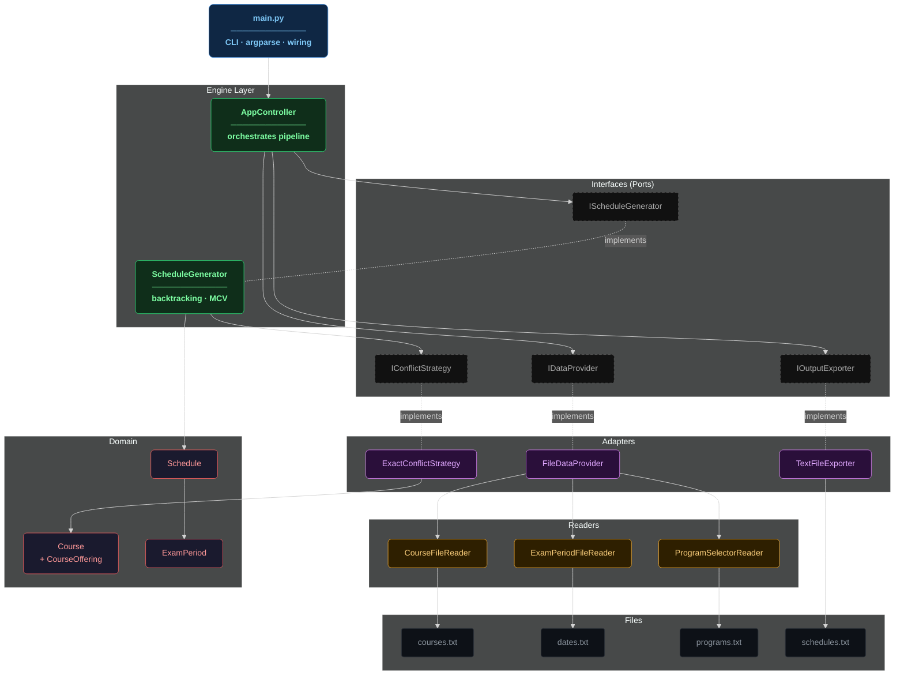
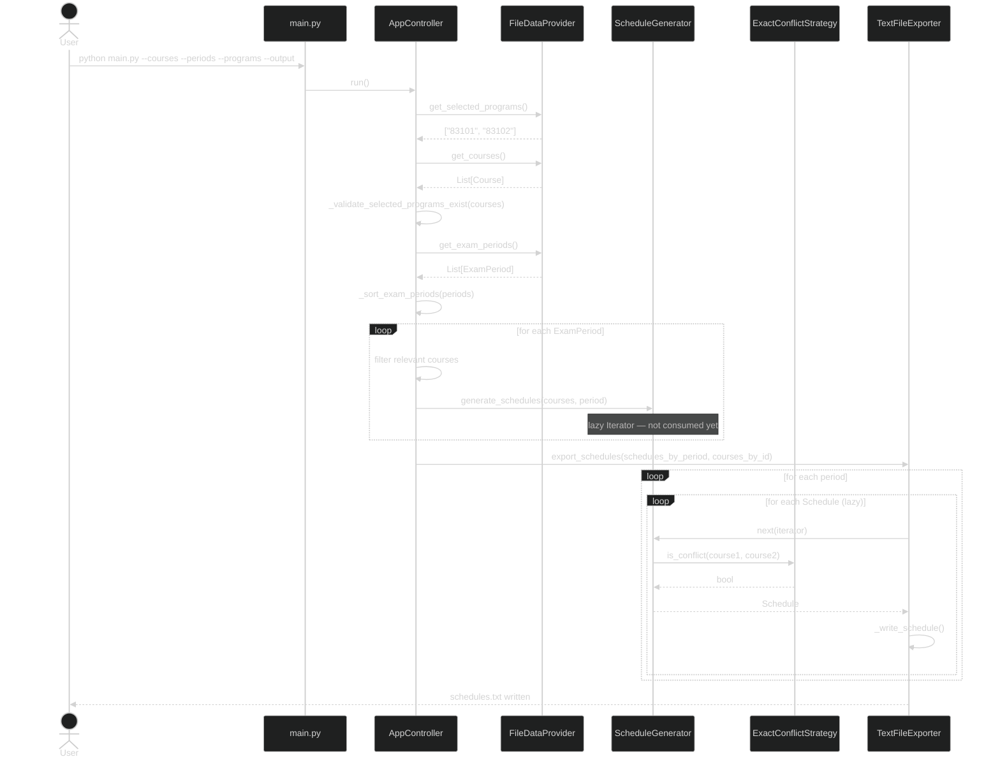
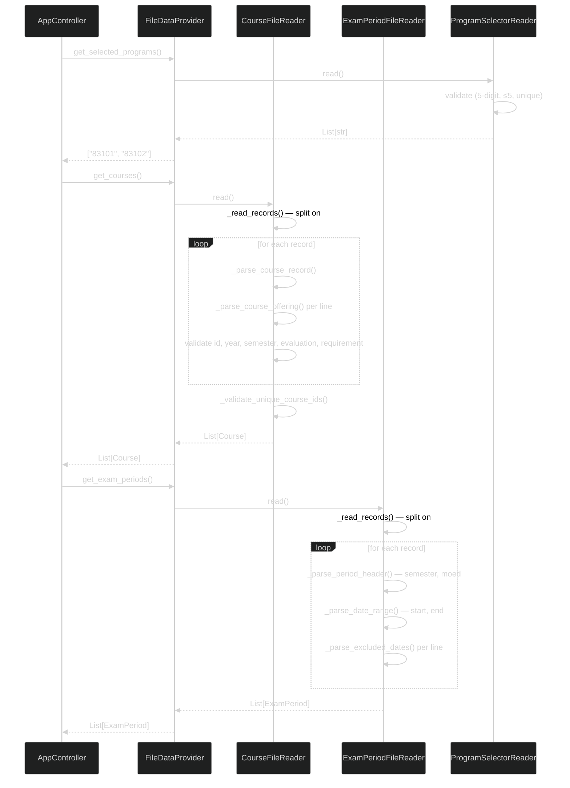
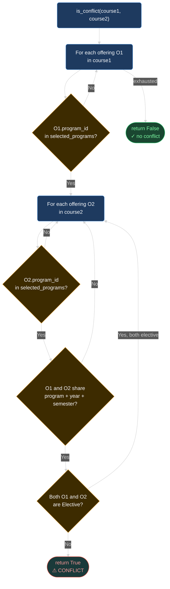
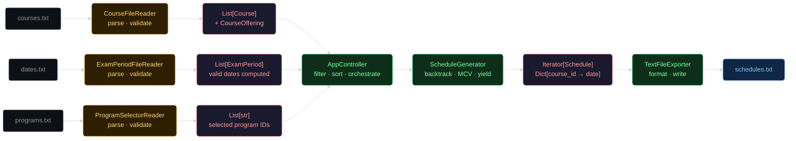
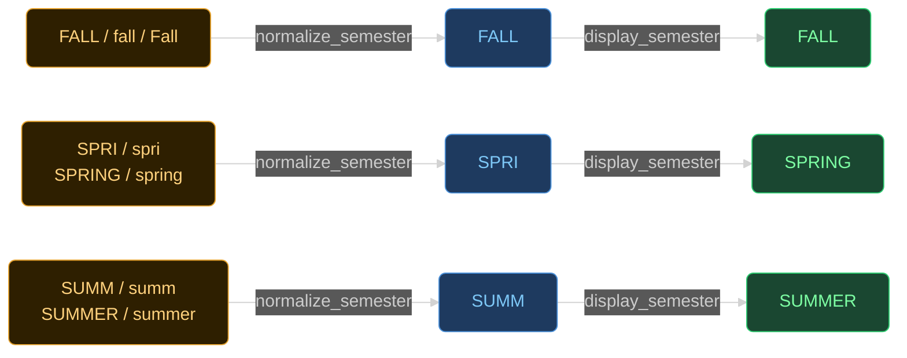

# examSchedule — All Diagrams

---

## 1. System Hierarchy



---

## 2. Clean Architecture — Layer Dependencies

```mermaid
%%{init: {'theme': 'dark'}}%%
flowchart LR
    classDef cli     fill:#0f2744,stroke:#4a90d9,color:#7ec8f7
    classDef engine  fill:#0f2e1a,stroke:#2ecc71,color:#7effa4
    classDef iface   fill:#1a1a1a,stroke:#555,color:#aaa,stroke-dasharray:4 2
    classDef adapter fill:#2a0f3a,stroke:#c678dd,color:#e0a8ff
    classDef domain  fill:#1a1a2e,stroke:#e05c5c,color:#ff9999

    subgraph CLI_LAYER["CLI"]
        main["main.py"]:::cli
    end

    subgraph ENGINE_LAYER["Engine"]
        AC["AppController"]:::engine
        SG["ScheduleGenerator"]:::engine
    end

    subgraph IFACE_LAYER["Interfaces (Ports)"]
        IDP["IDataProvider"]:::iface
        IOE["IOutputExporter"]:::iface
        ICS["IConflictStrategy"]:::iface
        ISG["IScheduleGenerator"]:::iface
    end

    subgraph ADAPTER_LAYER["Adapters"]
        FDP["FileDataProvider"]:::adapter
        TFE["TextFileExporter"]:::adapter
        ECS["ExactConflictStrategy"]:::adapter
    end

    subgraph DOMAIN_LAYER["Domain"]
        C["Course"]:::domain
        CO["CourseOffering"]:::domain
        EP["ExamPeriod"]:::domain
        S["Schedule"]:::domain
    end

    main --> AC
    AC --> IDP & IOE & ISG
    SG --> ICS
    SG ..|> ISG
    FDP ..|> IDP
    TFE ..|> IOE
    ECS ..|> ICS

    FDP --> C & EP
    ECS --> C
    SG --> S
    S --> EP
    C --> CO

    note["Dependency rule:\ninner layers know nothing\nabout outer layers"]
```

---

## 3. UML Class Diagram

```mermaid
classDiagram
    direction TB

    namespace Domain {
        class Course {
            +id : str
            +name : str
            +instructor : str
            +evaluation_type : str
            +offerings : List~CourseOffering~
            +add_offering(offering: CourseOffering) None
            +has_exam() bool
            +get_relevant_offerings(programs: List, semester: str) List~CourseOffering~
            +is_relevant_for_period(programs: List, semester: str) bool
        }
        class CourseOffering {
            +program_id : str
            +year : int
            +semester : str
            +requirement : str
            +is_relevant(programs: List, semester: str) bool
            +is_elective() bool
            +same_program_year_semester(other: CourseOffering) bool
        }
        class ExamPeriod {
            +semester : str
            +moed : str
            +date_ranges : List~Tuple~date_date~~
            +excluded_dates : Set~date~
            +get_valid_dates() List~date~
            +get_key() str
        }
        class Schedule {
            +period : ExamPeriod
            +assignments : Dict~str_date~
        }
    }

    namespace Interfaces {
        class IDataProvider {
            <<interface>>
            +get_courses() List~Course~
            +get_exam_periods() List~ExamPeriod~
            +get_selected_programs() List~str~
        }
        class IOutputExporter {
            <<interface>>
            +export_schedules(schedules_by_period: Dict, courses_by_id: Dict) None
        }
        class IConflictStrategy {
            <<interface>>
            +is_conflict(course1: Course, course2: Course) bool
        }
        class IScheduleGenerator {
            <<interface>>
            +generate_schedules(courses: List, period: ExamPeriod) Iterator~Schedule~
        }
    }

    namespace Engine {
        class AppController {
            <<controller>>
            -_data_provider : IDataProvider
            -_exporter : IOutputExporter
            -_generator : IScheduleGenerator
            -_selected_programs : List~str~
            +run() None
            -_sort_exam_periods(periods) List~ExamPeriod~
            -_validate_selected_programs_exist(courses) None
        }
        class ScheduleGenerator {
            <<engine>>
            -_strategy : IConflictStrategy
            +generate_schedules(courses: List, period: ExamPeriod) Iterator~Schedule~
            -_build_conflict_graph(courses: List) Dict~Course_Set~Course~~
            -_backtrack(assignment remaining valid_dates conflict_graph period) Iterator~Schedule~
        }
    }

    namespace Adapters {
        class FileDataProvider {
            <<adapter>>
            +course_reader : CourseFileReader
            +exam_period_reader : ExamPeriodFileReader
            +program_reader : ProgramSelectorReader
            +get_courses() List~Course~
            +get_exam_periods() List~ExamPeriod~
            +get_selected_programs() List~str~
        }
        class TextFileExporter {
            <<adapter>>
            +output_path : Path
            +export_schedules(schedules_by_period: Dict, courses_by_id: Dict) None
            -_write_period_header(file semester: str, moed: str) None
            -_write_schedule(file n: int, schedule: Schedule, courses_by_id: Dict) None
            -_split_period_key(period_key: str) Tuple~str_str~
        }
        class ExactConflictStrategy {
            <<adapter>>
            -_selected_programs : Set~str~
            +is_conflict(course1: Course, course2: Course) bool
        }
    }

    namespace Readers {
        class CourseFileReader {
            +courses_path : Path
            +read() List~Course~
        }
        class ExamPeriodFileReader {
            +periods_path : Path
            +read() List~ExamPeriod~
        }
        class ProgramSelectorReader {
            +programs_path : Path
            +read() List~str~
        }
    }

    Course "1" *-- "0..*" CourseOffering : contains
    Schedule --> ExamPeriod : period

    FileDataProvider ..|> IDataProvider
    TextFileExporter ..|> IOutputExporter
    ExactConflictStrategy ..|> IConflictStrategy
    ScheduleGenerator ..|> IScheduleGenerator

    AppController --> IDataProvider : uses
    AppController --> IScheduleGenerator : uses
    AppController --> IOutputExporter : uses
    ScheduleGenerator --> IConflictStrategy : consults
    ScheduleGenerator ..> Schedule : yields

    FileDataProvider --> CourseFileReader : delegates
    FileDataProvider --> ExamPeriodFileReader : delegates
    FileDataProvider --> ProgramSelectorReader : delegates
```



---

## 4. Sequence — Full Pipeline



---

## 5. Sequence — Data Loading



---

## 6. Scheduling Algorithm — Backtracking + MCV

```mermaid
%%{init: {'theme': 'dark'}}%%
flowchart LR
    classDef start fill:#1a4731,stroke:#2ecc71,color:#fff,rx:20
    classDef step  fill:#1e3a5f,stroke:#4a90d9,color:#fff,rx:6
    classDef check fill:#3d2b00,stroke:#e5a22e,color:#fff,rx:6
    classDef bad   fill:#5c1a1a,stroke:#e74c3c,color:#fff,rx:6
    classDef good  fill:#1a3a3a,stroke:#1abc9c,color:#fff,rx:20

    S([Start]):::start
    DATES["Resolve valid dates\nfrom ExamPeriod\n(exclude Sat + holidays)"]:::step
    GRAPH["Build conflict graph\nO(n²) — once"]:::step
    MCV["Sort courses by\nconflict count DESC\n(MCV heuristic)"]:::step
    TRY["Try next available date\nfor current course"]:::step
    CHK{Date blocked by\nassigned neighbor?}:::check
    ASSIGN["Assign date\nto course"]:::step
    DONE{All courses\nassigned?}:::check
    BACK["Backtrack —\ndel assignment\ntry next date"]:::bad
    WIN([Yield Schedule ✓\nDict[course_id → date]]):::good
    EMPTY([Return — no\nmore schedules]):::bad

    S --> DATES --> GRAPH --> MCV --> TRY --> CHK
    CHK -- No --> ASSIGN --> DONE
    CHK -- Yes --> TRY
    DONE -- Yes --> WIN
    WIN --> TRY
    DONE -- No --> TRY
    TRY -- No dates left --> BACK --> TRY
    BACK -- No courses left --> EMPTY
```

---

## 7. Conflict Detection Logic



---

## 8. Data Flow — Input to Output



---

## 9. Test Architecture

```mermaid
%%{init: {'theme': 'dark'}}%%
flowchart TD
    classDef layer fill:#1e3a5f,stroke:#4a90d9,color:#fff,rx:6
    classDef unit  fill:#1a4731,stroke:#2ecc71,color:#7effa4,rx:4
    classDef e2e   fill:#4a1942,stroke:#c678dd,color:#e0a8ff,rx:4
    classDef stat  fill:#0d1117,stroke:#30363d,color:#8b949e,rx:4

    UNIT["Unit Tests\n74 functions"]:::layer
    E2E["E2E Tests\n10 functions"]:::layer

    U1["test_course.py\n12 tests"]:::unit
    U2["test_course_offering.py\n10 tests"]:::unit
    U3["test_exam_period.py\n9 tests"]:::unit
    U4["test_schedule.py\n2 tests"]:::unit
    U5["test_conflict_strategy.py\n7 tests · 1 parametrized×6"]:::unit
    U6["test_schedule_generator.py\n12 tests"]:::unit
    U7["test_file_data_provider.py\n15 tests"]:::unit
    U8["test_text_file_exporter.py\n7 tests"]:::unit

    E1["test_full_pipeline.py\n10 tests\nsynthetic + real data"]:::e2e

    TOTAL["84 functions · 89 pytest runs\nAll passing ✓"]:::stat

    UNIT --> U1 & U2 & U3 & U4 & U5 & U6 & U7 & U8
    E2E --> E1
    UNIT & E2E --> TOTAL
```



---

## 10. Semester Normalization


